# 🏗️ Hive → Open-Source Campus Platform: Architectural Analysis & Migration Blueprint

> **Author**: Principal Architect Review  
> **Date**: July 2026  
> **Scope**: Full repository audit of [Code-JAM](file:///c:/Users/vaibh/Documents/GitHub/Code-JAM) — transforming a college-specific Flask prototype into a self-hostable, extensible campus platform.

---

## Table of Contents

1. [Current Architecture](#1-current-architecture)
2. [Weaknesses](#2-weaknesses)
3. [Scalability Bottlenecks](#3-scalability-bottlenecks)
4. [Hardcoded Assumptions](#4-hardcoded-assumptions)
5. [Technical Debt](#5-technical-debt)
6. [Suggested Folder Structure](#6-suggested-folder-structure)
7. [Suggested Module Architecture](#7-suggested-module-architecture)
8. [Suggested Database Architecture](#8-suggested-database-architecture)
9. [Public API Strategy](#9-public-api-strategy)
10. [Plugin Architecture](#10-plugin-architecture)
11. [Theme Architecture](#11-theme-architecture)
12. [Setup Wizard Design](#12-setup-wizard-design)
13. [Deployment Strategy](#13-deployment-strategy)
14. [Folder-by-Folder Migration Plan](#14-folder-by-folder-migration-plan)
15. [Priority Roadmap](#15-priority-roadmap)

---

## 1. Current Architecture

### 1.1 High-Level Topology

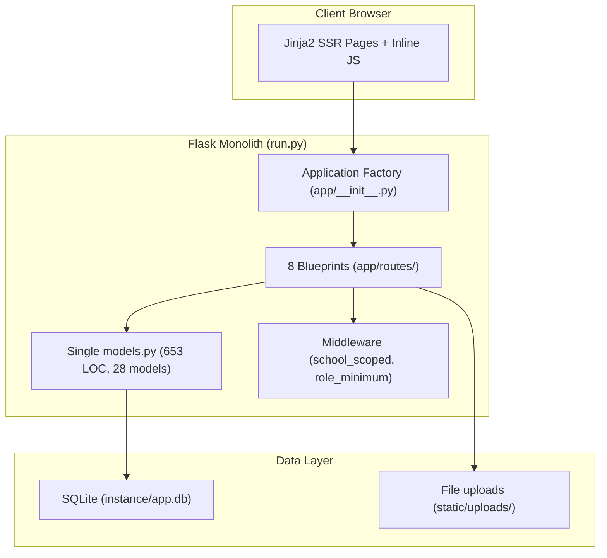

### 1.2 Component Inventory

| Layer | Component | File(s) | LOC |
|-------|-----------|---------|-----|
| **Entry** | App factory + dev server | [run.py](file:///c:/Users/vaibh/Documents/GitHub/Code-JAM/run.py), [app/__init__.py](file:///c:/Users/vaibh/Documents/GitHub/Code-JAM/app/__init__.py) | ~135 |
| **Models** | All 28 ORM models in one file | [models.py](file:///c:/Users/vaibh/Documents/GitHub/Code-JAM/app/models.py) | 653 |
| **Middleware** | Tenant isolation + RBAC | [middleware.py](file:///c:/Users/vaibh/Documents/GitHub/Code-JAM/app/middleware.py) | 117 |
| **Routes** | 8 blueprints | [app/routes/](file:///c:/Users/vaibh/Documents/GitHub/Code-JAM/app/routes) | ~2,800 |
| **Templates** | 37 Jinja2 templates | [templates/](file:///c:/Users/vaibh/Documents/GitHub/Code-JAM/templates) | ~6,000 |
| **Styles** | Single CSS file | [styles.css](file:///c:/Users/vaibh/Documents/GitHub/Code-JAM/static/css/styles.css) | 879 |
| **Seeding** | Hardcoded institution data | [init_db.py](file:///c:/Users/vaibh/Documents/GitHub/Code-JAM/init_db.py) | 1,154 |
| **Frontend** | Separate landing page | [frontend/](file:///c:/Users/vaibh/Documents/GitHub/Code-JAM/frontend) | ~300 |

### 1.3 Multi-Tenancy Model

The app uses a **shared database, shared schema** multi-tenancy model via `school_id` foreign keys. The `School` model acts as the top-level tenant, and `@school_scoped` middleware enforces isolation per request by injecting `g.school_id`.

### 1.4 Role Hierarchy

Defined as a flat dictionary in [models.py L11-18](file:///c:/Users/vaibh/Documents/GitHub/Code-JAM/app/models.py#L11-L18):

```
student(1) → class_rep(2) → assistant_professor(3) → professor(4) → dean(5) → admin(99) → superadmin(100)
```

### 1.5 Feature Modules

| Module | Blueprint | Key Models |
|--------|-----------|------------|
| Auth & Sessions | `auth_bp` | User, bcrypt |
| Dashboard (Student/Teacher/Admin/Dean) | `dashboard_bp` | Student, Teacher, Course, TimetableEntry, Announcement, Grade, Attendance |
| Classroom | `classroom_bp` | Course, Assignment, Submission, Enrollment, Attendance, TeacherRating |
| Messaging | `messages_bp` | Message, MessageLog |
| Fees | `fees_bp` | Fee, FeePayment |
| Internships | `internships_bp` | Internship |
| Lost & Found | `lost_found_bp` | LostFoundItem |
| Clubs & Events | `clubs_bp` | Club, ExternalEvent |

---

## 2. Weaknesses

### 2.1 Architectural Weaknesses

| # | Weakness | Severity | Location |
|---|----------|----------|----------|
| W1 | **God Blueprint** — `dashboard.py` is 1,185 LOC with 40+ routes spanning admin, student, teacher, dean, timetable management, settings, and analytics | 🔴 Critical | [dashboard.py](file:///c:/Users/vaibh/Documents/GitHub/Code-JAM/app/routes/dashboard.py) |
| W2 | **Monolithic models file** — 28 models in a single 653-line file with no domain separation | 🔴 Critical | [models.py](file:///c:/Users/vaibh/Documents/GitHub/Code-JAM/app/models.py) |
| W3 | **No migration framework** — Uses `db.create_all()` / `drop_all()` instead of Alembic | 🔴 Critical | [run.py L23-24](file:///c:/Users/vaibh/Documents/GitHub/Code-JAM/run.py#L23-L24) |
| W4 | **No test suite** — Zero unit tests, integration tests, or test infrastructure | 🔴 Critical | Root directory |
| W5 | **No API layer** — All endpoints return HTML or ad-hoc JSON. No versioned REST/GraphQL API | 🟡 High | All routes |
| W6 | **No CSRF protection** — Comment in [messages.py L217](file:///c:/Users/vaibh/Documents/GitHub/Code-JAM/app/routes/messages.py#L217) acknowledges missing CSRF validation | 🔴 Critical | [messages.py](file:///c:/Users/vaibh/Documents/GitHub/Code-JAM/app/routes/messages.py) |
| W7 | **In-memory rate limiter** — `password_change_attempts` dictionary is process-local, lost on restart, broken under multi-worker | 🟡 High | [auth.py L148](file:///c:/Users/vaibh/Documents/GitHub/Code-JAM/app/routes/auth.py#L148) |
| W8 | **No async/background tasks** — All operations synchronous, including notification matching | 🟡 High | [lost_found.py](file:///c:/Users/vaibh/Documents/GitHub/Code-JAM/app/routes/lost_found.py) |
| W9 | **No logging infrastructure** — Debug via `print()` statements | 🟡 High | [dashboard.py L231](file:///c:/Users/vaibh/Documents/GitHub/Code-JAM/app/routes/dashboard.py#L231) |
| W10 | **Dual auth decorators** — `@login_required` in `auth.py` vs `@school_scoped` in `middleware.py` serve overlapping purposes | 🟠 Medium | [auth.py L12](file:///c:/Users/vaibh/Documents/GitHub/Code-JAM/app/routes/auth.py#L12), [middleware.py L18](file:///c:/Users/vaibh/Documents/GitHub/Code-JAM/app/middleware.py#L18) |

### 2.2 Design Weaknesses

| # | Weakness | Impact |
|---|----------|--------|
| D1 | **Session-only auth** — No JWT/token support; no "remember me", no API authentication | Blocks mobile/API consumers |
| D2 | **No form validation library** — Manual `request.form.get()` everywhere with minimal sanitization | Input injection risk, code duplication |
| D3 | **No pagination** — All queries return unbounded results (`.all()`) | Will choke at scale |
| D4 | **Template-coupled business logic** — Placeholders injected directly in route handlers: `s.attendance = 85` | [classroom.py L31-33](file:///c:/Users/vaibh/Documents/GitHub/Code-JAM/app/routes/classroom.py#L31-L33) |
| D5 | **No separation of concerns** — Route handlers mix DB queries, business logic, notifications, and response formatting | All route files |

---

## 3. Scalability Bottlenecks

### 3.1 Database Bottlenecks

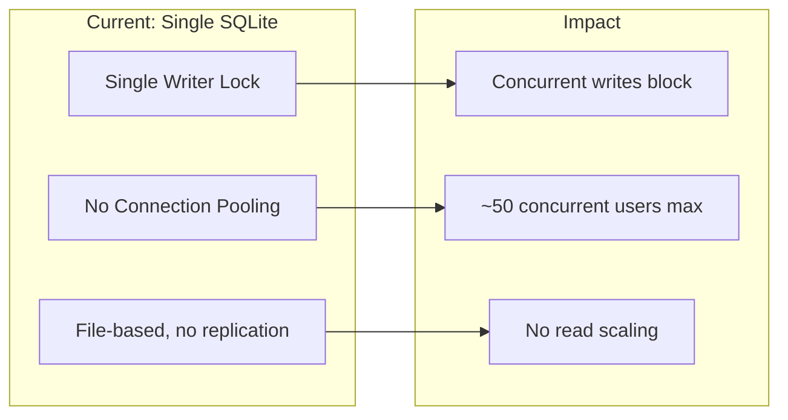

| Bottleneck | Detail | Threshold |
|------------|--------|-----------|
| **SQLite single writer** | SQLite uses a global write lock. Concurrent writes serialize. | ~50 concurrent users |
| **N+1 query patterns** | `school_scoped` runs 2 queries per request (unread messages count + announcements). Teacher dashboard runs 8+ queries in a loop. | Latency degrades linearly with data size |
| **Unbounded `.all()` queries** | `User.query.all()` in admin views, `Fee.query.all()` in fee dashboard | Memory explosion at 10K+ records |
| **Plotly server-side rendering** | `pandas` + `plotly` imported at route level, generating JSON on every page load | CPU spike per teacher dashboard request |
| **In-process file storage** | Uploads stored in `static/uploads/` within the app directory | No CDN, no scaling across instances |
| **Notification queries in middleware** | Every authenticated request triggers 2 additional DB queries in `school_scoped` | Adds ~10ms per request baseline |

### 3.2 Application Bottlenecks

| Bottleneck | Detail |
|------------|--------|
| **Synchronous architecture** | All I/O is blocking — a slow DB query blocks the entire worker |
| **No caching layer** | Zero Redis/memcached usage; every page is computed from scratch |
| **Heavyweight dependencies on every request** | Plotly (12MB) and Pandas imported in route files |
| **No CDN for static assets** | CSS, JS, images served by Flask's built-in static handler |

---

## 4. Hardcoded Assumptions

> [!CAUTION]
> These hardcoded values prevent any other institution from deploying Hive without modifying source code.

### 4.1 Institution-Specific Hardcoding

| # | What's Hardcoded | Location | Impact |
|---|------------------|----------|--------|
| H1 | **Real student names and emails** from Sai University SCDS | [init_db.py L15-620](file:///c:/Users/vaibh/Documents/GitHub/Code-JAM/init_db.py#L15-L100) | 1,154 lines of institution-specific PII |
| H2 | **Email domain** `scds.saiuniversity.edu.in` | init_db.py throughout | Login assumes specific domain |
| H3 | **School code** `SCDS` and `SOAI` | init_db.py seed functions | Requires code changes to add schools |
| H4 | **Section naming** `SCDS-CS-S1` through `SCDS-CS-S7` | init_db.py | Non-generic naming scheme |
| H5 | **Course catalog** — specific CS curriculum courses | init_db.py timetable seeders | Only CS department supported |
| H6 | **Room names** `AB1-104`, `AB2-207`, etc. | init_db.py timetable data | Building-specific room IDs |
| H7 | **Batch year** `2025` everywhere | init_db.py | No dynamic academic year |
| H8 | **Default password** `hive@1234` | [init_db.py L1119](file:///c:/Users/vaibh/Documents/GitHub/Code-JAM/init_db.py#L1119) | Security risk in production |
| H9 | **Currency symbol** `₹` hardcoded in fees | [fees.py L67](file:///c:/Users/vaibh/Documents/GitHub/Code-JAM/app/routes/fees.py#L67) | Only works for Indian institutions |
| H10 | **Lab section magic number** `3` for lab filtering | [dashboard.py L54](file:///c:/Users/vaibh/Documents/GitHub/Code-JAM/app/routes/dashboard.py#L54) | Undocumented, institution-specific logic |
| H11 | **Day range** `0-4` (Mon-Fri) — no support for Saturday classes | [dashboard.py L40](file:///c:/Users/vaibh/Documents/GitHub/Code-JAM/app/routes/dashboard.py#L40) | Many institutions have Saturday schedules |
| H12 | **Time format** `%I:%M%p` with no timezone | dashboard.py throughout | Assumes single timezone |
| H13 | **Academic hours** `9:00 AM - 5:15 PM` hardcoded in free-slot calculator | [dashboard.py L629-630](file:///c:/Users/vaibh/Documents/GitHub/Code-JAM/app/routes/dashboard.py#L629-L630) | Institution-specific |
| H14 | **Low CGPA threshold** `1.5` hardcoded in early warning | [dashboard.py L1167](file:///c:/Users/vaibh/Documents/GitHub/Code-JAM/app/routes/dashboard.py#L1167) | Policy should be configurable |
| H15 | **Timetable colors** as hex/CSS variables in seed data | init_db.py timetable entries | Style data mixed with domain data |
| H16 | **Lost & Found categories** hardcoded in routes | [lost_found.py L39](file:///c:/Users/vaibh/Documents/GitHub/Code-JAM/app/routes/lost_found.py#L39) | Should be admin-configurable |
| H17 | **Avg attendance** `"85%"` as string placeholder | [dashboard.py L179](file:///c:/Users/vaibh/Documents/GitHub/Code-JAM/app/routes/dashboard.py#L179) | Fake data in admin view |

---

## 5. Technical Debt

### 5.1 Debt Inventory

| # | Debt | Category | Effort to Fix |
|---|------|----------|---------------|
| TD1 | **CAPTCHA disabled** — commented-out validation at [auth.py L90-94](file:///c:/Users/vaibh/Documents/GitHub/Code-JAM/app/routes/auth.py#L90-L94) with TODO comment | Security | Low |
| TD2 | **Role string inconsistency** — `'teacher'` used in [messages.py L88,97](file:///c:/Users/vaibh/Documents/GitHub/Code-JAM/app/routes/messages.py#L88) and `'assistant'` at [L97](file:///c:/Users/vaibh/Documents/GitHub/Code-JAM/app/routes/messages.py#L97) but `VALID_ROLES` uses `'professor'` and `'assistant_professor'` — these filters will **never match** | 🐛 Bug | Low |
| TD3 | **`search_allowed` uses wrong role names** — [messages.py L295](file:///c:/Users/vaibh/Documents/GitHub/Code-JAM/app/routes/messages.py#L295): `'teacher'` and `'assistant'` don't exist in `VALID_ROLES` | 🐛 Bug | Low |
| TD4 | **`meet_link` attribute doesn't exist** — [dashboard.py L816](file:///c:/Users/vaibh/Documents/GitHub/Code-JAM/app/routes/dashboard.py#L816): `course.meet_link` referenced but not in `Course` model | 🐛 Bug | Low |
| TD5 | **`timetable_manager` role referenced** at [dashboard.py L897,1011](file:///c:/Users/vaibh/Documents/GitHub/Code-JAM/app/routes/dashboard.py#L897) but not in `VALID_ROLES` or `ROLE_HIERARCHY` | 🐛 Bug | Low |
| TD6 | **No database migrations** — Schema changes require full DB wipe | Architecture | High |
| TD7 | **`datetime.utcnow`** deprecated since Python 3.12 — should use `datetime.now(timezone.utc)` | Deprecation | Medium |
| TD8 | **Two competing frontends** — `frontend/` and `templates/` serve different purposes with no shared design system | Architecture | High |
| TD9 | **JSON stored as `db.Text`** for quiz questions, answers, badges — no structured querying possible | Schema | Medium |
| TD10 | **Inline JavaScript** in templates (modals, AJAX calls, chart rendering) rather than importable modules | Maintainability | High |
| TD11 | **Empty directories** — `app/owner/` and `app/upload/` exist but contain nothing | Cleanup | Trivial |
| TD12 | **`Flask-Login` in requirements but never used** — Session management is manual | Unused dependency | Low |
| TD13 | **Seed script is 1,154 lines** — contains PII of real students, impossible to extend for other institutions | Data architecture | High |
| TD14 | **`routes/__init__.py` only exports 5 of 8 blueprints** — out of sync | [routes/__init__.py](file:///c:/Users/vaibh/Documents/GitHub/Code-JAM/app/routes/__init__.py) | Low |

### 5.2 Debt Impact Matrix

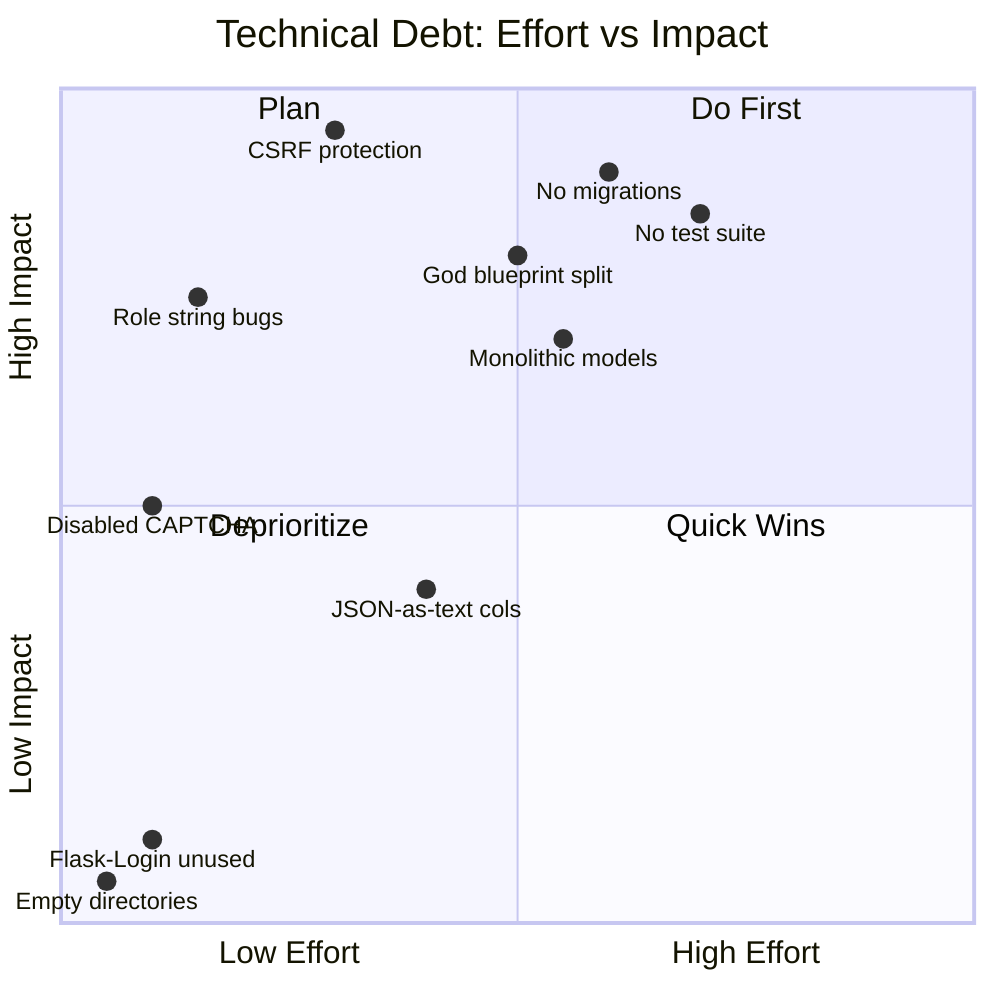

---

## 6. Suggested Folder Structure

> Inspired by Django's app-per-feature, WordPress's plugin system, and Discourse's engine-based modularity.

```
hive/
├── hive/                          # Core application package
│   ├── __init__.py                # Application factory
│   ├── config.py                  # Configuration classes (dev/prod/test)
│   ├── extensions.py              # Extension singletons (db, bcrypt, migrate, mail, cache)
│   ├── cli.py                     # Click CLI commands (setup, seed, import, export)
│   │
│   ├── core/                      # Core framework (not a "feature")
│   │   ├── __init__.py
│   │   ├── auth/                  # Authentication & session management
│   │   │   ├── __init__.py
│   │   │   ├── models.py          # User, Role, Permission
│   │   │   ├── routes.py          # Login, logout, password reset
│   │   │   ├── forms.py           # WTForms with CSRF
│   │   │   ├── services.py        # Auth business logic
│   │   │   └── decorators.py      # @login_required, @role_required
│   │   ├── tenant/                # Multi-tenancy engine
│   │   │   ├── __init__.py
│   │   │   ├── models.py          # Institution, Department, AcademicYear
│   │   │   ├── middleware.py       # Tenant resolution & isolation
│   │   │   └── services.py
│   │   └── settings/              # Site-wide settings registry
│   │       ├── __init__.py
│   │       ├── models.py          # SiteSetting (key-value store)
│   │       ├── defaults.py        # Default setting values
│   │       └── services.py        # get_setting(), set_setting()
│   │
│   ├── modules/                   # Feature modules (each is self-contained)
│   │   ├── __init__.py
│   │   ├── academics/             # Courses, Enrollment, Sections
│   │   │   ├── __init__.py
│   │   │   ├── models.py
│   │   │   ├── routes.py
│   │   │   ├── api.py             # REST API endpoints
│   │   │   ├── services.py
│   │   │   ├── forms.py
│   │   │   ├── importers.py       # CSV/Excel bulk import
│   │   │   └── templates/
│   │   │       └── academics/
│   │   ├── timetable/
│   │   │   ├── __init__.py
│   │   │   ├── models.py
│   │   │   ├── routes.py
│   │   │   ├── api.py
│   │   │   ├── services.py
│   │   │   └── templates/
│   │   │       └── timetable/
│   │   ├── assessment/            # Assignments, Quizzes, Grades
│   │   │   └── ...
│   │   ├── attendance/
│   │   │   └── ...
│   │   ├── messaging/
│   │   │   └── ...
│   │   ├── fees/
│   │   │   └── ...
│   │   ├── announcements/
│   │   │   └── ...
│   │   ├── classroom/
│   │   │   └── ...
│   │   ├── analytics/             # Dashboards & reporting
│   │   │   └── ...
│   │   ├── clubs/
│   │   │   └── ...
│   │   ├── lost_found/
│   │   │   └── ...
│   │   └── internships/
│   │       └── ...
│   │
│   ├── api/                       # Public REST API (versioned)
│   │   ├── __init__.py
│   │   ├── v1/
│   │   │   ├── __init__.py
│   │   │   ├── auth.py
│   │   │   ├── courses.py
│   │   │   ├── timetable.py
│   │   │   └── schemas.py         # Marshmallow serializers
│   │   └── middleware.py          # API key auth, rate limiting
│   │
│   ├── plugins/                   # Plugin engine
│   │   ├── __init__.py
│   │   ├── registry.py            # Plugin discovery & lifecycle
│   │   ├── base.py                # HivePlugin abstract base class
│   │   └── hooks.py               # Signal/hook definitions
│   │
│   ├── themes/                    # Theme engine
│   │   ├── __init__.py
│   │   ├── loader.py              # Theme template & asset loader
│   │   ├── default/               # Built-in default theme
│   │   │   ├── theme.json         # Theme manifest
│   │   │   ├── templates/
│   │   │   ├── static/
│   │   │   │   ├── css/
│   │   │   │   ├── js/
│   │   │   │   └── images/
│   │   │   └── partials/
│   │   └── README.md              # Theme development guide
│   │
│   └── utils/                     # Shared utilities
│       ├── __init__.py
│       ├── pagination.py
│       ├── validators.py
│       ├── importers.py           # Generic CSV/Excel import engine
│       ├── exporters.py           # Data export (CSV, PDF)
│       └── notifications.py       # Notification dispatch service
│
├── migrations/                    # Alembic migration scripts
│
├── tests/                         # Test suite
│   ├── conftest.py                # Fixtures, test app factory
│   ├── unit/
│   ├── integration/
│   └── e2e/
│
├── plugins/                       # Community/local plugins directory
│   └── example_plugin/
│       ├── plugin.json
│       ├── __init__.py
│       └── ...
│
├── docs/                          # Documentation
│   ├── setup.md
│   ├── plugin-dev.md
│   ├── theme-dev.md
│   ├── api-reference.md
│   └── contributing.md
│
├── docker/                        # Docker configuration
│   ├── Dockerfile
│   ├── docker-compose.yml
│   ├── docker-compose.prod.yml
│   └── nginx.conf
│
├── scripts/                       # Operational scripts
│   ├── setup_wizard.py            # Interactive first-run setup
│   └── migrate_from_v1.py         # Migration helper from current codebase
│
├── instance/                      # Instance-specific data (gitignored)
│   ├── config.py                  # Instance configuration overrides
│   └── uploads/                   # User-uploaded files
│
├── pyproject.toml                 # Modern Python packaging
├── requirements/
│   ├── base.txt
│   ├── dev.txt
│   └── prod.txt
├── .env.example
├── README.md
├── CONTRIBUTING.md
├── LICENSE
└── Makefile                       # Common commands shortcut
```

---

## 7. Suggested Module Architecture

### 7.1 Module Anatomy

Every module follows the same internal structure. This is what makes the project easy for contributors to extend — **learn one module, understand them all**.

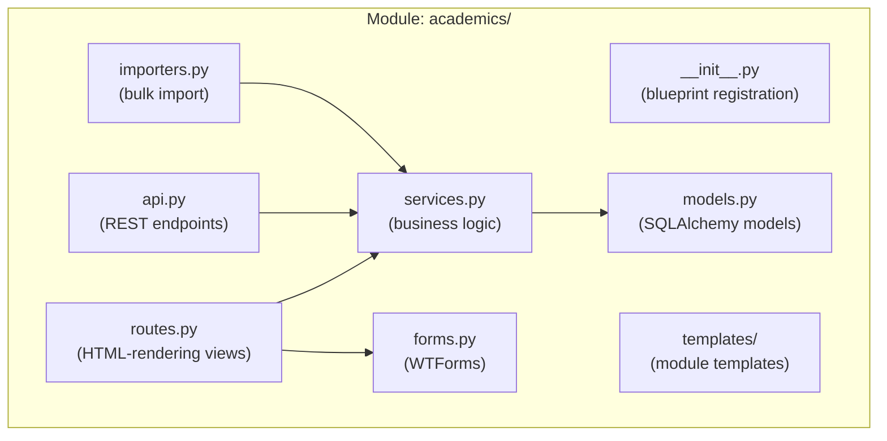

### 7.2 Module Contract

Each module must implement a standard `__init__.py`:

```python
# hive/modules/academics/__init__.py
from flask import Blueprint

bp = Blueprint('academics', __name__, 
               template_folder='templates',
               url_prefix='/academics')

def init_module(app):
    """Called during app startup. Register routes, signals, CLI commands."""
    from . import routes, api
    app.register_blueprint(bp)
```

### 7.3 Module Dependency Map

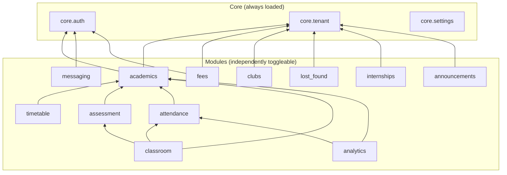

### 7.4 Module Toggle Configuration

```python
# instance/config.py
HIVE_MODULES = {
    'academics': True,        # Required
    'timetable': True,
    'assessment': True,
    'attendance': True,
    'messaging': True,
    'fees': False,            # Disable for institutions without online fees
    'announcements': True,
    'classroom': True,
    'analytics': True,
    'clubs': True,
    'lost_found': True,
    'internships': False,     # Disable if not needed
}
```

---

## 8. Suggested Database Architecture

### 8.1 Multi-Database Strategy

| Environment | Database | Why |
|-------------|----------|-----|
| Development | SQLite | Zero-config, single file |
| Small Deployment (< 500 users) | SQLite or PostgreSQL | Low overhead |
| Production (500+ users) | PostgreSQL | Concurrent writes, JSONB, full-text search, row-level security |
| High Scale (5000+ users) | PostgreSQL + Redis | Caching, sessions, background jobs |

### 8.2 Revised Entity-Relationship Design

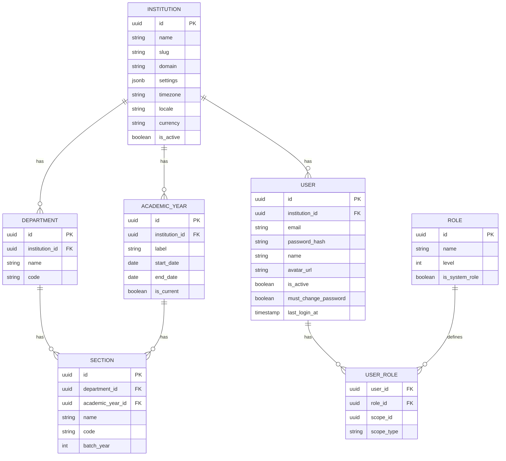

### 8.3 Key Schema Improvements

| Current | Proposed | Why |
|---------|----------|-----|
| Integer PKs | UUIDs | Prevent enumeration attacks, enable distributed ID generation |
| Flat `role` string on User | Separate `Role` + `UserRole` junction with scoping | Users can have different roles in different contexts (e.g., student in one dept, TA in another) |
| `school_id` everywhere | `institution_id` with `Department` layer | Supports hierarchical org structures |
| No academic year concept | `AcademicYear` model | Enables semester/year boundaries, archival, rollover |
| `Quiz.questions` as JSON text | JSONB column (Postgres) or separate `Question` model | Queryable, indexable, validatable |
| `Fee` with hardcoded columns per fee type | Generic `FeeLineItem` model | Flexible fee structures per institution |
| `TimetableEntry.color` in model | Move to theme/display layer | Presentation data shouldn't be in domain models |
| `TimetableEntry.teacher` as string | Use `teacher_id` FK only | Denormalized string gets out of sync |
| No `updated_at` on most models | Add `updated_at` + `created_at` as mixins | Auditing, sync, caching |

### 8.4 Settings Table

Replace all hardcoded values with a key-value store:

```python
class SiteSetting(db.Model):
    __tablename__ = 'site_settings'
    
    key = db.Column(db.String(100), primary_key=True)
    value = db.Column(db.Text)                     # JSON-encoded
    value_type = db.Column(db.String(20))           # string, int, bool, json
    institution_id = db.Column(UUID, nullable=True)  # NULL = global default
    category = db.Column(db.String(50))              # 'academic', 'fees', 'ui', etc.
    description = db.Column(db.String(200))
```

Example settings:
- `academic.day_range` → `[0, 1, 2, 3, 4, 5]`
- `academic.start_time` → `"08:00"`
- `academic.end_time` → `"17:30"`
- `academic.timezone` → `"Asia/Kolkata"`
- `fees.currency` → `"INR"`
- `fees.currency_symbol` → `"₹"`
- `early_warning.cgpa_threshold` → `1.5`
- `early_warning.attendance_threshold` → `75`
- `lost_found.categories` → `["Electronics", "ID Cards", ...]`
- `messaging.rate_limit.student` → `10`

---

## 9. Public API Strategy

### 9.1 API Design Principles

| Principle | Implementation |
|-----------|---------------|
| **Versioned** | `/api/v1/...` prefix, version in URL |
| **RESTful** | Standard HTTP verbs, resource-oriented URLs |
| **Authenticated** | Token-based (JWT) for API consumers, session-based for browser |
| **Rate-limited** | Per-role limits via Flask-Limiter + Redis |
| **Documented** | Auto-generated OpenAPI 3.0 spec via apispec/Flask-Smorest |
| **Paginated** | Cursor-based pagination by default |
| **Filterable** | Query parameter conventions: `?status=active&sort=-created_at` |

### 9.2 Resource Map

```
/api/v1/
├── /auth/
│   ├── POST   /login                    → JWT token
│   ├── POST   /logout                   → Revoke token
│   └── POST   /refresh                  → Refresh JWT
│
├── /institutions/
│   ├── GET    /                          → List institutions (admin)
│   ├── POST   /                          → Create institution (admin)
│   └── GET    /:id                       → Institution details
│
├── /users/
│   ├── GET    /me                        → Current user profile
│   ├── GET    /                          → List users (scoped by role)
│   └── POST   /bulk-import               → CSV upload endpoint
│
├── /courses/
│   ├── GET    /                          → List courses (scoped)
│   ├── GET    /:id                       → Course detail
│   ├── GET    /:id/enrollments           → Enrolled students
│   └── GET    /:id/assignments           → Course assignments
│
├── /timetable/
│   ├── GET    /sections/:id/entries      → Timetable for section
│   ├── GET    /me                        → Current user's timetable
│   └── PUT    /entries/:id               → Update entry (admin)
│
├── /attendance/
│   ├── POST   /courses/:id/mark          → Bulk mark attendance
│   └── GET    /students/:id/summary      → Student attendance stats
│
├── /announcements/
│   ├── GET    /                          → Feed (scoped)
│   └── POST   /                          → Create announcement
│
└── /settings/
    ├── GET    /                          → Current settings
    └── PUT    /:key                      → Update setting (admin)
```

### 9.3 API Authentication Flow

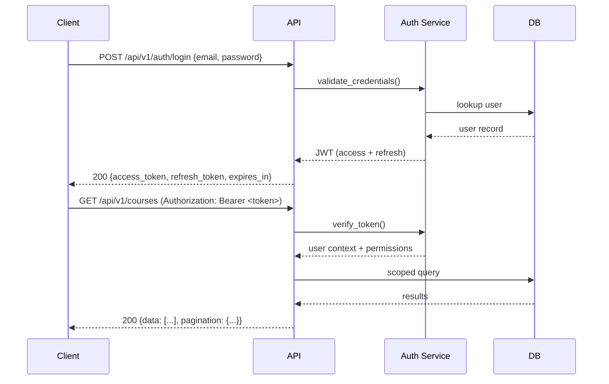

---

## 10. Plugin Architecture

### 10.1 Design Philosophy

Like WordPress hooks and Django signals — plugins observe and extend the core without modifying it.

### 10.2 Plugin Structure

```
plugins/
└── hive_library_plugin/
    ├── plugin.json                # Manifest
    ├── __init__.py                # Plugin entry point
    ├── models.py                  # Additional database models
    ├── routes.py                  # Blueprint registration
    ├── api.py                     # API extensions
    ├── templates/                 # Plugin-specific templates
    │   └── library/
    ├── static/                    # Plugin assets
    └── migrations/                # Plugin-specific migrations
```

### 10.3 Plugin Manifest (`plugin.json`)

```json
{
  "name": "Library Management",
  "slug": "hive-library",
  "version": "1.0.0",
  "description": "Book lending, reservations, and fine tracking",
  "author": "Hive Community",
  "requires_hive": ">=2.0.0",
  "requires_modules": ["academics"],
  "provides_models": ["Book", "BookLending", "LibraryFine"],
  "provides_routes": ["/library"],
  "provides_hooks": ["book_lent", "book_returned"],
  "nav_items": [
    {
      "label": "Library",
      "icon": "local_library",
      "url": "/library",
      "roles": ["student", "professor", "admin"]
    }
  ],
  "settings": {
    "library.max_books_per_student": {
      "type": "integer",
      "default": 5,
      "label": "Max books per student"
    },
    "library.lending_period_days": {
      "type": "integer",
      "default": 14,
      "label": "Default lending period (days)"
    }
  }
}
```

### 10.4 Plugin Base Class

```python
# hive/plugins/base.py

class HivePlugin:
    """Abstract base class for all Hive plugins."""
    
    def __init__(self, app=None):
        self.app = app
        
    def init_app(self, app):
        """Called during application startup."""
        self.app = app
        self.register_models()
        self.register_routes()
        self.register_hooks()
        self.register_templates()
        self.register_nav_items()
    
    def register_models(self): ...
    def register_routes(self): ...
    def register_hooks(self): ...
    def register_templates(self): ...
    def register_nav_items(self): ...
    
    def activate(self): ...
    def deactivate(self): ...
    def uninstall(self): ...
```

### 10.5 Hook/Signal System

```python
# hive/plugins/hooks.py
from blinker import Namespace

hive_signals = Namespace()

# Core hooks that plugins can listen to
user_logged_in = hive_signals.signal('user-logged-in')
user_created = hive_signals.signal('user-created')
course_created = hive_signals.signal('course-created')
enrollment_changed = hive_signals.signal('enrollment-changed')
assignment_submitted = hive_signals.signal('assignment-submitted')
attendance_marked = hive_signals.signal('attendance-marked')
announcement_posted = hive_signals.signal('announcement-posted')
timetable_changed = hive_signals.signal('timetable-changed')
fee_paid = hive_signals.signal('fee-paid')
grade_posted = hive_signals.signal('grade-posted')
navigation_rendering = hive_signals.signal('navigation-rendering')
dashboard_rendering = hive_signals.signal('dashboard-rendering')
```

### 10.6 Plugin Lifecycle

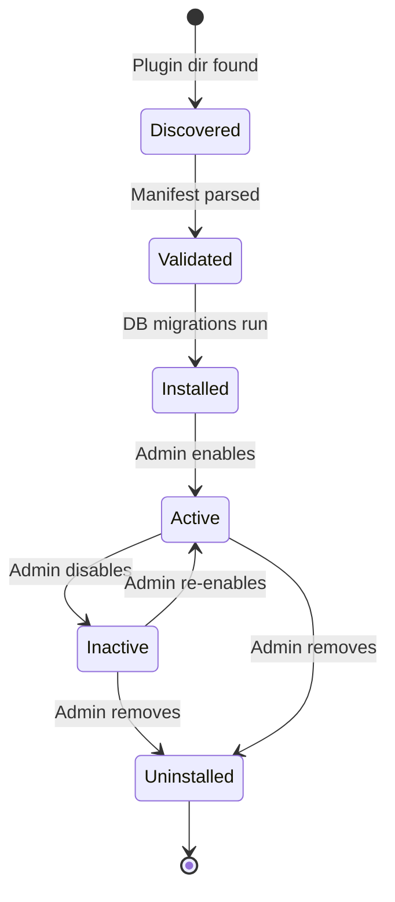

---

## 11. Theme Architecture

### 11.1 Theme Structure

```
hive/themes/
├── default/                       # Ships with Hive
│   ├── theme.json                 # Manifest
│   ├── templates/                 # Template overrides
│   │   ├── base.html              # Master layout
│   │   ├── partials/
│   │   │   ├── _navbar.html
│   │   │   ├── _sidebar.html
│   │   │   └── _footer.html
│   │   └── pages/
│   │       ├── login.html
│   │       └── dashboard.html
│   └── static/
│       ├── css/
│       │   ├── variables.css      # CSS custom properties only
│       │   ├── base.css           # Layout & typography
│       │   └── components.css     # Reusable component styles
│       ├── js/
│       │   └── theme.js
│       └── images/
│           ├── logo-light.svg
│           └── logo-dark.svg
│
└── campus-dark/                   # Community theme example
    ├── theme.json
    ├── templates/                 # Only files that differ from default
    │   └── base.html
    └── static/
        └── css/
            └── variables.css      # Override CSS variables only
```

### 11.2 Theme Manifest (`theme.json`)

```json
{
  "name": "Hive Default",
  "slug": "default",
  "version": "1.0.0",
  "description": "The default Hive theme — clean, modern, accessible",
  "author": "Hive Team",
  "requires_hive": ">=2.0.0",
  "parent": null,
  "supports": {
    "dark_mode": true,
    "rtl": false,
    "custom_colors": true
  },
  "color_schemes": {
    "light": {
      "primary": "#2563eb",
      "background": "#ffffff",
      "text": "#0f172a"
    },
    "dark": {
      "primary": "#dc2626",
      "background": "#000000",
      "text": "#f8fafc"
    }
  }
}
```

### 11.3 Theme Resolution Order

Templates are resolved via a **cascading loader** (similar to WordPress child themes):

```
1. Active Theme → templates/module_name/template.html
2. Parent Theme → templates/module_name/template.html (if theme has parent)
3. Module Default → modules/module_name/templates/template.html
4. Core Fallback → templates/base.html
```

### 11.4 CSS Variable-Based Theming

All styling uses CSS custom properties. A theme only needs to override `variables.css`:

```css
/* themes/campus-dark/static/css/variables.css */
:root {
  --hive-primary: #6366f1;
  --hive-primary-light: #818cf8;
  --hive-bg-main: #0f172a;
  --hive-bg-card: #1e293b;
  --hive-text-main: #e2e8f0;
  --hive-font-heading: 'Outfit', sans-serif;
  --hive-font-body: 'Inter', sans-serif;
  --hive-sidebar-width: 260px;
  --hive-radius-card: 16px;
}
```

### 11.5 Institution Branding

Administrators can customize without creating a full theme:

| Setting | Type | Example |
|---------|------|---------|
| `brand.name` | string | `"MIT Campus Hub"` |
| `brand.logo_url` | string | `/uploads/branding/logo.svg` |
| `brand.favicon_url` | string | `/uploads/branding/favicon.png` |
| `brand.primary_color` | string | `"#6366f1"` |
| `brand.accent_color` | string | `"#f59e0b"` |

These are injected as CSS variables at runtime in `base.html`, overriding the theme defaults.

---

## 12. Setup Wizard Design

### 12.1 Flow

```mermaid
graph LR
    S1["1. Welcome<br/>Language, Terms"] --> S2["2. Database<br/>SQLite/PostgreSQL"]
    S2 --> S3["3. Institution<br/>Name, Domain, Timezone"]
    S3 --> S4["4. Admin Account<br/>Email, Password"]
    S4 --> S5["5. Modules<br/>Enable/Disable features"]
    S5 --> S6["6. Bulk Import<br/>CSV: Students, Faculty"]
    S6 --> S7["7. Academic Setup<br/>Year, Semesters, Departments"]
    S7 --> S8["8. Theme & Branding<br/>Logo, Colors"]
    S8 --> S9["9. Review & Deploy<br/>Summary, Health Check"]
    S9 --> S10["✅ Dashboard"]
```

### 12.2 Implementation Strategy

The setup wizard runs as a **first-run experience** — detected by the absence of a `setup_complete` flag in the database or a `HIVE_SETUP_COMPLETE` environment variable.

**Two modes:**
1. **CLI Mode** (`python -m hive setup`) — Interactive terminal wizard using `click` prompts. Ideal for SSH/headless setups.
2. **Web Mode** (default) — Accessible at `/setup` when the app has no admin user. A multi-step HTML form rendered by a `setup` blueprint that is only registered when `setup_complete = False`.

### 12.3 Bulk Import Engine

The import system is critical for adoption. It should support:

| Data Type | Format | Required Columns | Optional Columns |
|-----------|--------|-------------------|-----------------|
| Students | CSV, Excel | name, email, section_code | enrollment_year, major, lab_section |
| Faculty | CSV, Excel | name, email, role, department | office_hours |
| Courses | CSV, Excel | name, code, section_code, teacher_email, credits | max_students |
| Timetable | CSV, Excel | section_code, day, start_time, end_time, course_code, room | period, color |
| Fees | CSV, Excel | student_email, tuition, lab_fee | library_fee, exam_fee |

**Import workflow:**
1. Upload file → Parse & validate → Show preview with error highlighting → Confirm → Execute → Show summary report

---

## 13. Deployment Strategy

### 13.1 Deployment Tiers

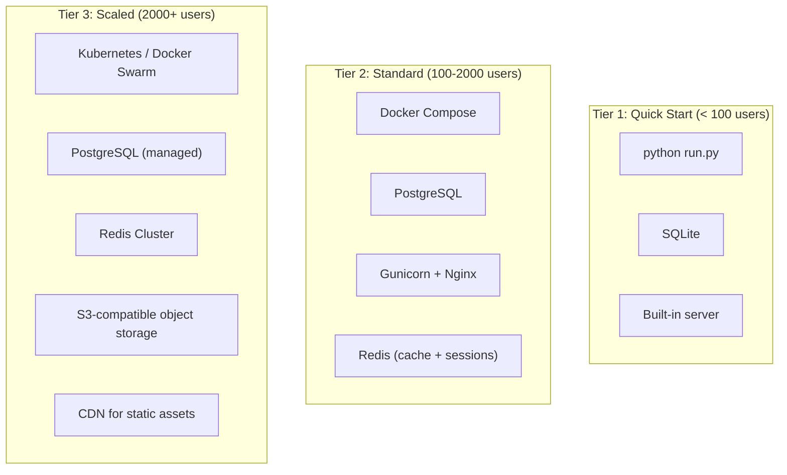

### 13.2 Docker Compose (Standard Deployment)

```yaml
# docker/docker-compose.yml (conceptual)
services:
  hive:
    build: .
    environment:
      - DATABASE_URL=postgresql://hive:secret@db:5432/hive
      - REDIS_URL=redis://redis:6379/0
      - SECRET_KEY=${SECRET_KEY}
    ports:
      - "8000:8000"
    depends_on:
      - db
      - redis

  db:
    image: postgres:16-alpine
    volumes:
      - pgdata:/var/lib/postgresql/data
    environment:
      - POSTGRES_DB=hive
      - POSTGRES_USER=hive
      - POSTGRES_PASSWORD=secret

  redis:
    image: redis:7-alpine
    
  nginx:
    image: nginx:alpine
    ports:
      - "80:80"
      - "443:443"
    volumes:
      - ./nginx.conf:/etc/nginx/nginx.conf

volumes:
  pgdata:
```

### 13.3 One-Command Deployment

```bash
# Quick start for small colleges (no Docker needed)
pip install hive-campus
hive setup
hive run

# Standard deployment
git clone https://github.com/your-org/hive.git
cd hive
cp .env.example .env
docker compose up -d
# Visit http://localhost → Setup Wizard starts
```

### 13.4 Platform Support Matrix

| Platform | Support Level | Notes |
|----------|---------------|-------|
| Ubuntu 22.04+ / Debian 12+ | ✅ Primary | CI-tested |
| macOS | ✅ Development | Homebrew dependencies |
| Windows (WSL2) | ✅ Development | Via WSL2 |
| Docker | ✅ Production | Official images |
| Railway / Render / Fly.io | ✅ One-Click | `Procfile` + config |
| Heroku | ✅ One-Click | Buildpack support |
| AWS / GCP / Azure | ✅ Documented | Terraform/CDK templates |

---

## 14. Folder-by-Folder Migration Plan

> [!IMPORTANT]
> This migration is designed to be executed **incrementally** — each phase should result in a working, deployable application. No big-bang rewrites.

### Phase 0: Foundation (No Code Changes)

| # | Task | From | To |
|---|------|------|----|
| 0.1 | Add Alembic for migrations | `db.create_all()` | `flask db init` + migration scripts |
| 0.2 | Add `pyproject.toml` | `requirements.txt` | Modern packaging |
| 0.3 | Split requirements | `requirements.txt` | `requirements/{base,dev,prod}.txt` |
| 0.4 | Add pytest infrastructure | (none) | `tests/conftest.py` + first smoke test |
| 0.5 | Add `Makefile` | (none) | Common commands |

---

### Phase 1: Core Extraction

| # | Task | From | To |
|---|------|------|----|
| 1.1 | Extract `extensions.py` | `app/models.py` L1-6 | `hive/extensions.py` (db, bcrypt, migrate) |
| 1.2 | Extract `config.py` | `app/__init__.py` L13-38 | `hive/config.py` (Dev/Prod/Test classes) |
| 1.3 | Create Settings module | Hardcoded values everywhere | `hive/core/settings/` with `SiteSetting` model |
| 1.4 | Extract auth module | `app/routes/auth.py` | `hive/core/auth/` (models, routes, forms, services) |
| 1.5 | Extract tenant module | `app/middleware.py` | `hive/core/tenant/` (middleware, models) |
| 1.6 | Fix role string bugs | `messages.py` L88, L295 | Use `VALID_ROLES` constants consistently |
| 1.7 | Add CSRF protection | (none) | Flask-WTF globally |

---

### Phase 2: Model Decomposition

| # | Current Location | Target | Models |
|---|-----------------|--------|--------|
| 2.1 | `models.py` L28-72 | `core/tenant/models.py` | `Institution` (was School), `Department`, `Section`, `AcademicYear` |
| 2.2 | `models.py` L79-137 | `core/auth/models.py` | `User`, `Role`, `UserRole`, `Student`, `Teacher` |
| 2.3 | `models.py` L143-189 | `modules/academics/models.py` | `Course`, `Enrollment` |
| 2.4 | `models.py` L196-305 | `modules/assessment/models.py` | `Assignment`, `Submission`, `Quiz`, `QuizAttempt`, `Grade`, `Streak` |
| 2.5 | `models.py` L260-276 | `modules/attendance/models.py` | `Attendance` |
| 2.6 | `models.py` L312-380 | `modules/messaging/models.py` | `Message`, `MessageLog`, `Resource` |
| 2.7 | `models.py` L386-398 | `modules/academics/models.py` | `CustomTask` |
| 2.8 | `models.py` L404-445 | `modules/timetable/models.py` | `TimetableEntry` |
| 2.9 | `models.py` L451-468 | Respective modules | `TeacherTodo`, `TeacherRating` |
| 2.10 | `models.py` L474-528 | `modules/fees/models.py` | `Fee`, `FeePayment` |
| 2.11 | `models.py` L534-548 | `modules/internships/models.py` | `Internship` |
| 2.12 | `models.py` L554-571 | `modules/lost_found/models.py` | `LostFoundItem` |
| 2.13 | `models.py` L577-653 | `modules/clubs/models.py` + `modules/academics/models.py` | `Club`, `ExternalEvent`, `ProfessorAssistant`, `ClassRepNomination` |
| 2.14 | `models.py` L312-334 | `modules/announcements/models.py` | `Announcement` |

---

### Phase 3: Route Decomposition (The God Blueprint)

The [dashboard.py](file:///c:/Users/vaibh/Documents/GitHub/Code-JAM/app/routes/dashboard.py) file (1,185 LOC) must be split:

| # | Current Route(s) | Target Module | New File |
|---|-----------------|---------------|----------|
| 3.1 | `student_dashboard` (L33-61) | `modules/classroom/` | `routes.py` |
| 3.2 | `teacher_dashboard` (L64-151) | `modules/classroom/` | `routes.py` |
| 3.3 | `admin_dashboard` (L153-195) | `modules/analytics/` | `routes.py` |
| 3.4 | `admin_timetable*` (L198-461) — 6 routes | `modules/timetable/` | `routes.py` |
| 3.5 | `timetable` (L464-596) | `modules/timetable/` | `routes.py` |
| 3.6 | `get_common_free_slots` (L600-721) | `modules/timetable/` | `services.py` |
| 3.7 | `tasks*` (L724-805) — 5 routes | `modules/academics/` | `routes.py` |
| 3.8 | `grades`, `announcements` (L822-848) | `modules/assessment/`, `modules/announcements/` | `routes.py` |
| 3.9 | `my_courses` (L859-907) | `modules/academics/` | `routes.py` |
| 3.10 | `school_analytics`, `early_warning` (L910-1177) | `modules/analytics/` | `routes.py` |
| 3.11 | `dean_*` (L951-1007) — 3 routes | `modules/analytics/` | `routes.py` |
| 3.12 | `manage_timetable` (L1009-1052) | `modules/timetable/` | `routes.py` |
| 3.13 | `admin_schools*`, `admin_sections*`, `admin_accounts*` (L1055-1153) | `core/tenant/` | `admin_routes.py` |
| 3.14 | `admin_settings` (L1179-1185) | `core/settings/` | `routes.py` |

---

### Phase 4: Template Reorganization

| # | Current Location | Target |
|---|-----------------|--------|
| 4.1 | `templates/base.html` | `hive/themes/default/templates/base.html` |
| 4.2 | `templates/login.html` | `hive/core/auth/templates/auth/login.html` |
| 4.3 | `templates/change_password.html` | `hive/core/auth/templates/auth/change_password.html` |
| 4.4 | `templates/dashboard/student_dashboard.html` | `hive/modules/classroom/templates/classroom/student_dashboard.html` |
| 4.5 | `templates/dashboard/teacher_dashboard.html` | `hive/modules/classroom/templates/classroom/teacher_dashboard.html` |
| 4.6 | `templates/dashboard/admin_*` | Split across `analytics/`, `tenant/`, `settings/` |
| 4.7 | `templates/dashboard/timetable*` | `hive/modules/timetable/templates/timetable/` |
| 4.8 | `templates/classroom/` | `hive/modules/classroom/templates/classroom/` |
| 4.9 | `templates/messages/` | `hive/modules/messaging/templates/messaging/` |
| 4.10 | `templates/fees/` | `hive/modules/fees/templates/fees/` |
| 4.11 | `templates/internships/` + `internships.html` | `hive/modules/internships/templates/internships/` |
| 4.12 | `templates/lost_found/` | `hive/modules/lost_found/templates/lost_found/` |
| 4.13 | `templates/clubs/` | `hive/modules/clubs/templates/clubs/` |

---

### Phase 5: Seed Data Replacement

| # | Task | Detail |
|---|------|--------|
| 5.1 | Delete all PII from `init_db.py` | Remove 620+ lines of real student data |
| 5.2 | Create `fixtures/demo.json` | Generic demo data: "Acme University", "Jane Doe", etc. |
| 5.3 | Build CSV import engine | `hive/utils/importers.py` — Parse, validate, preview, execute |
| 5.4 | Create `hive import` CLI command | `hive import students --file students.csv` |
| 5.5 | Provide sample CSV templates | `docs/import-templates/students.csv`, `courses.csv`, etc. |

---

### Phase 6: API & Plugin Layer

| # | Task |
|---|------|
| 6.1 | Add Flask-Smorest or Flask-RESTX for API framework |
| 6.2 | Create `hive/api/v1/` with auth, courses, timetable endpoints |
| 6.3 | Add Marshmallow schemas for serialization |
| 6.4 | Implement JWT auth for API (Flask-JWT-Extended) |
| 6.5 | Build plugin registry (`hive/plugins/registry.py`) |
| 6.6 | Implement hook/signal system (blinker) |
| 6.7 | Create plugin CLI: `hive plugin install <name>` |

---

### Phase 7: Production Hardening

| # | Task |
|---|------|
| 7.1 | Docker & docker-compose setup |
| 7.2 | Gunicorn/Uvicorn configuration |
| 7.3 | Nginx reverse proxy config |
| 7.4 | Health check endpoint (`/health`) |
| 7.5 | Structured logging (JSON logs) |
| 7.6 | Error tracking integration (Sentry-compatible) |
| 7.7 | Backup/restore CLI commands |
| 7.8 | Security audit: CSRF, XSS, SQLi, session fixation |

---

## 15. Priority Roadmap

### Phase Overview

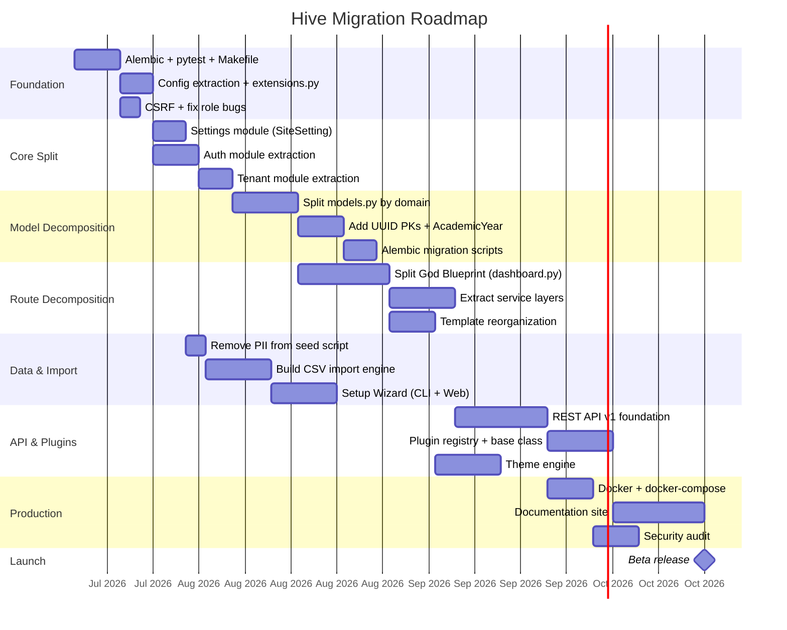

### Priority Matrix

| Priority | Phase | Estimated Effort | Why First |
|----------|-------|-----------------|-----------|
| 🔴 P0 | **Foundation** — Alembic, pytest, CSRF, bug fixes | 2 weeks | Cannot safely modify code without migrations and tests |
| 🔴 P0 | **Remove PII** — Delete real student data from repo | 1 day | Legal/ethical imperative for open-source |
| 🟡 P1 | **Core Extraction** — Settings, Auth, Tenant modules | 2 weeks | Unblocks all other refactoring |
| 🟡 P1 | **Model Decomposition** — Split models.py | 2 weeks | Enables modular architecture |
| 🟠 P2 | **Route Decomposition** — Split dashboard.py | 3 weeks | Enables contributor-friendly codebase |
| 🟠 P2 | **CSV Import Engine** + Setup Wizard | 3 weeks | Critical for "any college can deploy" |
| 🔵 P3 | **REST API v1** | 2 weeks | Enables mobile apps, integrations |
| 🔵 P3 | **Plugin System** | 2 weeks | Enables community extensions |
| 🔵 P3 | **Theme Engine** | 2 weeks | Enables visual customization |
| ⚪ P4 | **Docker + Production Hardening** | 2 weeks | One-command deployment |
| ⚪ P4 | **Documentation Site** | 2 weeks | Community adoption |

### Quick Wins (Can Be Done This Week)

| # | Task | Time | Impact |
|---|------|------|--------|
| QW1 | Fix role string bugs in `messages.py` (`'teacher'` → `'professor'`, `'assistant'` → `'assistant_professor'`) | 30 min | Fixes broken messaging |
| QW2 | Enable CSRF with Flask-WTF | 2 hours | Critical security fix |
| QW3 | Delete real student PII from `init_db.py` | 2 hours | Legal compliance |
| QW4 | Add `alembic init` + first migration | 1 hour | Foundation for schema evolution |
| QW5 | Replace `print()` with `logging` | 1 hour | Production readiness |
| QW6 | Remove `flask-login` from requirements (unused) | 5 min | Dependency hygiene |
| QW7 | Remove empty `app/owner/` and `app/upload/` directories | 5 min | Cleanup |
| QW8 | Replace `datetime.utcnow()` with `datetime.now(timezone.utc)` | 30 min | Fix deprecation warnings |

---

> [!TIP]
> **The single most impactful action** you can take right now is Phase 0 + removing PII. This turns Hive from a college project into a credible open-source project overnight. Everything else is incremental improvement on a solid foundation.
