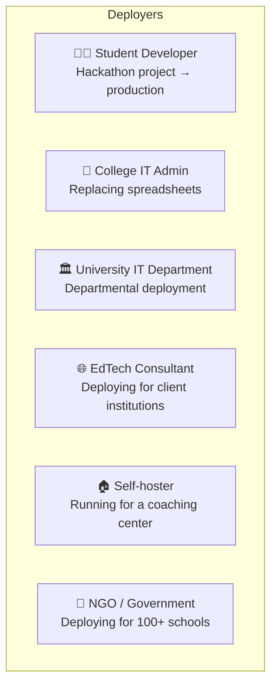
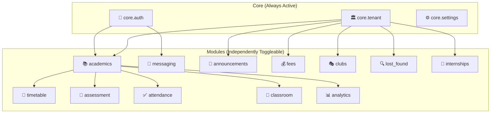
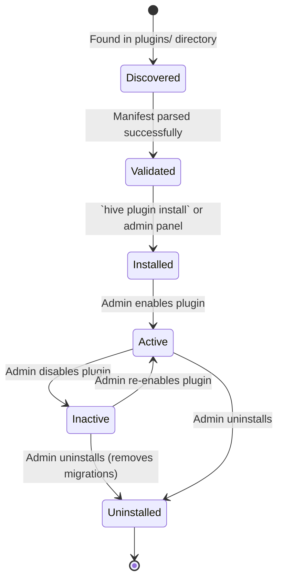
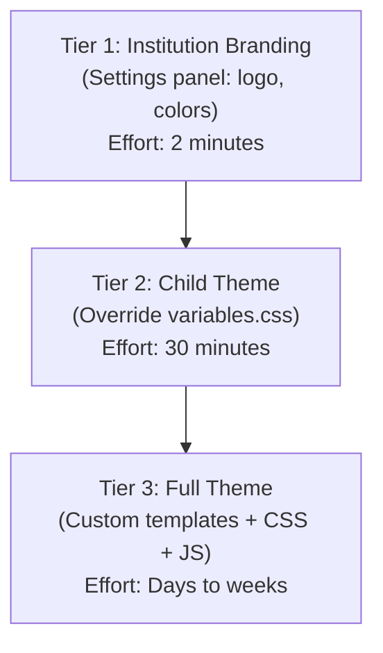
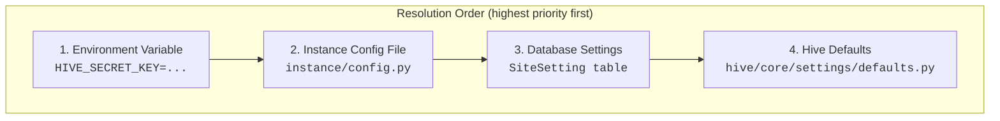
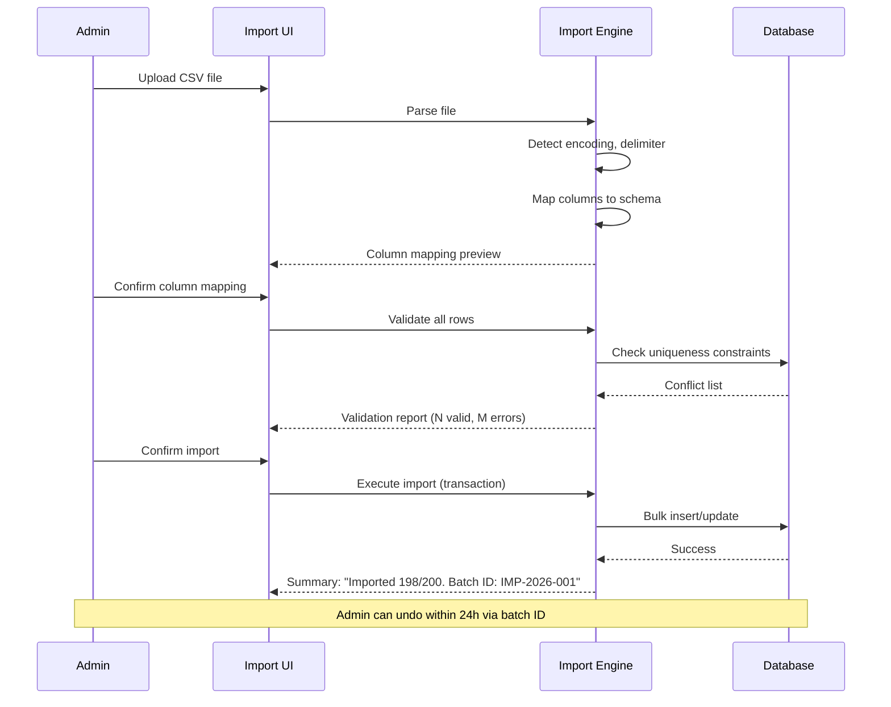
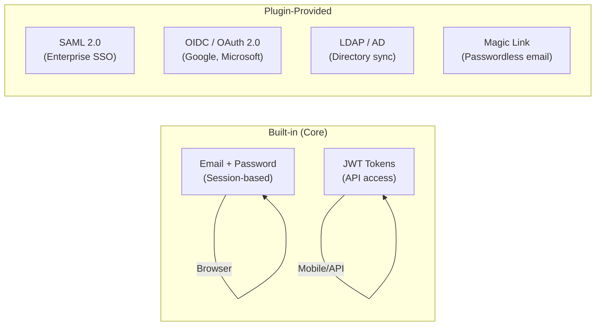
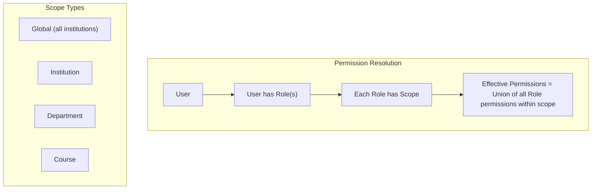
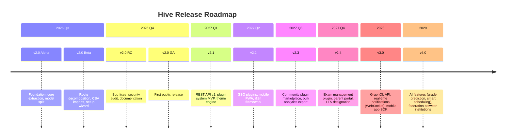

# 📋 Hive — Product Requirements Document (PRD)

> **Version**: 2.0 PRD  
> **Date**: July 6, 2026  
> **Status**: Draft — Awaiting Stakeholder Review  
> **Companion Document**: [Architectural Analysis](file:///c:/Users/vaibh/.gemini/antigravity-ide/brain/47b463ba-3a30-43af-81e5-ed62ceca9c3a/hive_architectural_analysis.md)

---

## Table of Contents

1. [Vision](#1-vision)
2. [Goals](#2-goals)
3. [Non-Goals](#3-non-goals)
4. [Target Users](#4-target-users)
5. [Personas](#5-personas)
6. [Feature List](#6-feature-list)
7. [Module List](#7-module-list)
8. [Plugin Philosophy](#8-plugin-philosophy)
9. [Theme Philosophy](#9-theme-philosophy)
10. [Configuration Philosophy](#10-configuration-philosophy)
11. [Import System](#11-import-system)
12. [Authentication](#12-authentication)
13. [Permissions](#13-permissions)
14. [Deployment](#14-deployment)
15. [Internationalization & Localization](#15-internationalization--localization)
16. [Accessibility](#16-accessibility)
17. [Future Roadmap](#17-future-roadmap)
18. [Success Metrics](#18-success-metrics)
19. [Release Plan](#19-release-plan)

---

## 1. Vision

### 1.1 The One-Liner

> **Hive is the WordPress of university campus platforms** — a free, open-source, self-hostable system that any college in the world can deploy in under 30 minutes to run their entire academic operation.

### 1.2 The Problem

Every year, thousands of colleges worldwide face the same problem: they need a digital platform to manage academics, timetables, attendance, fees, communication, and student life. Their options are:

| Option | Problem |
|--------|---------|
| **Commercial SaaS** (Blackboard, Canvas, PowerSchool) | Expensive. $5–50 per student/year. Lock-in. No customization. |
| **Government-mandated ERP** | Rigid. Doesn't fit the institution's actual workflows. |
| **Custom-built by IT dept** | Unmaintainable. No upgrade path. Dies when the developer leaves. |
| **Spreadsheets & WhatsApp** | The sad reality for most small colleges in the developing world. |

There is no **WordPress-equivalent** for campus management — a system that is free, works out of the box, is infinitely customizable through themes and plugins, and has a community of contributors making it better every day.

### 1.3 The Vision

Hive fills this gap. We envision a world where:

- A **small college in rural India** uses Hive to replace paper timetables and WhatsApp groups, running it on a $5/month VPS.
- A **mid-size European university** runs Hive with SSO integrated into their existing Active Directory, customized with a branded theme and plugins for their country's grading system.
- A **large research university in the US** deploys Hive across departments, with each department running its own plugins for lab management, thesis tracking, and research publication tracking.
- A **student developer** contributes a plugin for hostel room allocation during a hackathon, and it becomes used by 500 colleges within a year.

### 1.4 Positioning Statement

```
FOR        colleges and universities of any size, anywhere in the world
WHO        need a digital platform to manage academics, communication, and campus life
HIVE IS    an open-source, self-hostable campus management platform
THAT       works out of the box with sensible defaults, yet can be extended 
           infinitely through plugins, themes, and a public API
UNLIKE     commercial LMS/ERP systems (Blackboard, PowerSchool, Oracle Campus)
HIVE       is free, community-driven, and puts institutional control first —
           your data lives on your servers, and the platform bends to your 
           workflows, not the other way around.
```

### 1.5 Design Principles

| # | Principle | Meaning |
|---|-----------|---------|
| **P1** | **Convention Over Configuration** | Hive works with zero configuration. Every setting has a sensible default. An institution can go from install to first login in under 30 minutes. |
| **P2** | **Progressive Disclosure** | A small college sees a simple interface. A large university sees advanced options. Complexity is layered, never forced. |
| **P3** | **Institutional Sovereignty** | Your data, your server, your rules. No telemetry, no phoning home, no vendor lock-in. |
| **P4** | **Module Independence** | Modules are self-contained. Disabling the Fees module should never break the Timetable module. |
| **P5** | **Contributor Friendliness** | A new developer should be able to create a new module, plugin, or theme by following a 15-minute tutorial and copying a template. |
| **P6** | **Global by Default** | Every string is translatable, every date is timezone-aware, every currency is configurable. No assumptions about country, language, or calendar. |
| **P7** | **Accessible First** | WCAG 2.1 AA compliance. Every feature works with keyboard navigation and screen readers. |
| **P8** | **Offline-Aware** | Core features degrade gracefully without internet. Timetables, grades, and attendance should be viewable offline (PWA). |

---

## 2. Goals

### 2.1 Product Goals

| # | Goal | Measurable Target |
|---|------|--------------------|
| **G1** | **30-minute deployment** | From `git clone` to first admin login in ≤ 30 minutes with zero prior Flask knowledge |
| **G2** | **10-minute onboarding** | An admin can import students, create courses, and generate timetables within 10 minutes of first login via the Setup Wizard |
| **G3** | **100% institution-agnostic** | Zero source code changes required to deploy for any institution. All customization via settings, themes, and plugins |
| **G4** | **Plugin ecosystem** | A third-party developer can build, publish, and install a plugin without touching Hive core |
| **G5** | **Multi-institution support** | A single Hive instance can serve multiple schools/departments with full data isolation |
| **G6** | **API-first for integrations** | Every data read/write available via a versioned REST API with JWT authentication |
| **G7** | **Production-ready out of the box** | Docker-based deployment with PostgreSQL, Redis, Nginx, TLS, and automated backups |
| **G8** | **Contributor-friendly codebase** | A new contributor can submit a meaningful PR within their first hour of exploring the code |

### 2.2 Community Goals

| # | Goal | Target |
|---|------|--------|
| **CG1** | First 100 GitHub stars within 3 months of public launch |
| **CG2** | 10 community-contributed plugins within 6 months |
| **CG3** | Deployments across 5+ countries within 12 months |
| **CG4** | 50 contributors within 12 months |
| **CG5** | Official translations in 10 languages within 18 months |

---

## 3. Non-Goals

> [!IMPORTANT]
> Non-goals are just as important as goals. They prevent scope creep and keep the project focused.

| # | Non-Goal | Why |
|---|----------|-----|
| **NG1** | **Hive is NOT a full ERP** | We don't do payroll, HR management, procurement, or inventory. Campus operations only. |
| **NG2** | **Hive is NOT a video conferencing tool** | We integrate with Zoom/Meet/Teams via links and plugins. We don't build a video stack. |
| **NG3** | **Hive is NOT an email server** | We provide in-app messaging and notification dispatch to external channels (SMTP, webhooks). We don't replace institutional email. |
| **NG4** | **Hive is NOT a social media platform** | No infinite feeds, no public profiles, no follower graphs. Structured academic communication only. |
| **NG5** | **Hive is NOT a proctoring tool** | Exam proctoring involves surveillance software with deep OS integration. This is a plugin opportunity, not a core feature. |
| **NG6** | **Hive is NOT a SaaS product** | We don't offer hosted Hive. We build the software; institutions host it themselves. (Community members may offer hosting as a service.) |
| **NG7** | **Hive is NOT opinionated about pedagogy** | We don't mandate how a course should be structured, how grading should work, or what an assignment looks like. We provide tools; the institution decides the workflow. |
| **NG8** | **Hive does NOT process real payments in v2.0** | The Fees module tracks fees and records payments but does not integrate with real payment gateways in the initial release. Payment gateway plugins (Razorpay, Stripe, etc.) will be community-contributed. |

---

## 4. Target Users

### 4.1 Deployment Personas (Who Installs Hive)



| Persona | Technical Skill | Scale | Key Need |
|---------|----------------|-------|----------|
| **Student Developer** | Can follow a README. Knows Python basics. | 1 college, < 500 users | Works on their laptop. Impresses their dean. |
| **College IT Admin** | Comfortable with Linux, SSH, basic server admin. | 1 college, 500–5,000 users | Docker deploy. Auto-backups. Low maintenance. |
| **University IT Department** | Professional sysadmins. CI/CD. Monitoring. | Multi-department, 5,000–50,000 users | SSO integration, PostgreSQL, horizontal scaling. |
| **EdTech Consultant** | DevOps-savvy. Manages multiple deployments. | 10–100 institutions | Multi-tenant, white-labeling, bulk provisioning. |
| **Self-hoster** | Hobbyist. Raspberry Pi or cheap VPS. | 1 institution, < 200 users | Minimal resources. SQLite. Works on ARM. |
| **NGO / Government** | Varies. Needs clear documentation. | 100+ institutions, 100K+ users | Centralized management, reporting, compliance. |

### 4.2 Daily User Personas (Who Uses Hive)

| Persona | Count (per institution) | Primary Activities |
|---------|-------------------------|-------------------|
| **Students** | 80–95% of users | View timetable, check grades, submit assignments, read announcements, message professors |
| **Faculty / Professors** | 3–10% of users | Mark attendance, post assignments, view analytics, communicate with students |
| **Teaching Assistants** | 1–5% of users | Grade assignments, assist with attendance, manage course resources |
| **Department Heads / Deans** | 1–3 per department | View analytics, approve nominations, oversee faculty performance |
| **Admin Staff** | 2–10 per institution | Manage timetables, import data, manage accounts, configure settings |
| **Class Representatives** | 1 per section | Post announcements to their section, bridge student-faculty communication |
| **Club Coordinators** | 5–20 per institution | Manage club pages, post events, track membership |
| **Parents** (future) | 1–2 per student | View grades, attendance, fee status (read-only portal) |

---

## 5. Personas

### 5.1 Priya — The Student

> *"I just want to know what class I have next, if any assignment is due, and whether my attendance is okay."*

| Attribute | Detail |
|-----------|--------|
| **Age** | 19 |
| **Location** | Hyderabad, India |
| **Device** | Android phone (primary), shared laptop (secondary) |
| **Tech comfort** | Uses Instagram, WhatsApp daily. Never used a command line. |
| **Pain today** | Checks 3 WhatsApp groups for timetable changes, screenshots the timetable from a PDF, asks friends about assignment deadlines |
| **Hive value** | Single place for timetable, announcements, grades. Push notifications for changes. |
| **Success metric** | Opens Hive ≥ 3× per day. Never misses a timetable change. |

### 5.2 Dr. Ramesh — The Professor

> *"I teach 4 sections of 80 students each. I need to mark attendance, post resources, and see who's falling behind — without drowning in admin work."*

| Attribute | Detail |
|-----------|--------|
| **Age** | 45 |
| **Location** | Chennai, India |
| **Device** | Windows laptop, iPhone |
| **Tech comfort** | Uses Excel, email. Has used Moodle before and hated it. |
| **Pain today** | Carries a paper attendance register. Emails assignments as PDFs. Manually calculates at-risk students at the end of the semester — when it's too late. |
| **Hive value** | Digital attendance with early-warning alerts. Assignment deadlines auto-visible to students. Analytics showing who's struggling. |
| **Success metric** | Time spent on administrative tasks decreases by 50%. |

### 5.3 Ananya — The Admin Staff

> *"Every semester I manually create 200 student accounts, 40 courses, and a timetable. It takes me 2 weeks."*

| Attribute | Detail |
|-----------|--------|
| **Age** | 32 |
| **Location** | Pune, India |
| **Device** | Windows desktop |
| **Tech comfort** | Expert in Excel. Comfortable with web apps. Has never SSH'd into a server. |
| **Pain today** | Creates accounts one by one. Updates timetable in Google Sheets, then screenshots it. Handles fee queries via phone calls. |
| **Hive value** | CSV import: upload a spreadsheet, get 200 accounts in 30 seconds. Timetable builder with drag-and-drop. Fee dashboard shows who has paid. |
| **Success metric** | Semester setup time goes from 2 weeks to 2 hours. |

### 5.4 Vaibhav — The Student Developer

> *"I built Hive as a hackathon project. Now my college actually wants to use it. I need to make it work for real."*

| Attribute | Detail |
|-----------|--------|
| **Age** | 20 |
| **Location** | Andhra Pradesh, India |
| **Device** | Windows laptop with WSL |
| **Tech comfort** | Knows Python, Flask, JavaScript. First time building production software. |
| **Pain today** | Hardcoded his college's data into the seed script. Other colleges want to use it but can't without modifying source code. |
| **Hive value** | Architecture that separates institution data from code. Plugin system so other students can contribute features. Theme system so each college can brand it. |
| **Success metric** | 5 other colleges deploy Hive without needing Vaibhav's help. |

### 5.5 Dr. Maria — The Dean

> *"I need a bird's-eye view of my department. Which students are at risk? How are my faculty performing? Are we meeting our academic KPIs?"*

| Attribute | Detail |
|-----------|--------|
| **Age** | 52 |
| **Location** | Lisbon, Portugal |
| **Device** | MacBook, iPad |
| **Tech comfort** | Comfortable with dashboards. Expects things to "just work." |
| **Pain today** | Requests reports from admin staff, who compile them manually from multiple systems. Data is always 2 weeks stale. |
| **Hive value** | Real-time analytics dashboard. Early warning system for at-risk students. Faculty rating insights. |
| **Success metric** | Can answer any KPI question in under 60 seconds. |

### 5.6 James — The IT Administrator at a Large University

> *"I manage infrastructure for 15,000 students across 8 departments. I need SSO, LDAP integration, automated backups, and I need it in Docker."*

| Attribute | Detail |
|-----------|--------|
| **Age** | 38 |
| **Location** | London, UK |
| **Device** | Linux workstation |
| **Tech comfort** | Professional sysadmin. Terraform, Docker, Kubernetes. |
| **Pain today** | Evaluating Blackboard alternatives. Needs something that integrates with Microsoft Entra ID and the university's existing PostgreSQL cluster. |
| **Hive value** | Docker Compose production stack. SAML/OIDC SSO plugin. PostgreSQL native. REST API for integration with existing systems. |
| **Success metric** | Deploys in staging within 1 hour. Passes security audit. |

### 5.7 Fatima — The NGO Education Coordinator

> *"I need to deploy a unified platform across 50 rural colleges. Most have limited internet. None have IT staff."*

| Attribute | Detail |
|-----------|--------|
| **Age** | 40 |
| **Location** | Nairobi, Kenya |
| **Device** | Android phone, occasional laptop access |
| **Tech comfort** | Uses mobile apps. Not a developer. |
| **Pain today** | Each college uses paper records. Data collection requires physical visits. |
| **Hive value** | Multi-tenant mode: one central installation serving 50 colleges. Low-bandwidth-friendly. Offline timetable viewing (PWA). |
| **Success metric** | All 50 colleges onboarded within 3 months via centralized administration. |

### 5.8 Luca — The Plugin Developer

> *"I want to build a library management plugin for Hive. I've never contributed to open source before."*

| Attribute | Detail |
|-----------|--------|
| **Age** | 22 |
| **Location** | Milan, Italy |
| **Device** | macOS laptop |
| **Tech comfort** | Computer science student. Knows Python, some Flask. |
| **Pain today** | Wants to contribute but doesn't know where to start. Afraid of breaking things. |
| **Hive value** | Plugin scaffold generator (`hive plugin create library`). Clear documentation. Hook/signal system so his plugin doesn't touch core code. |
| **Success metric** | Goes from `hive plugin create` to a working plugin in under 2 hours. |

---

## 6. Feature List

### 6.1 Feature Priority Framework

| Label | Meaning | Release Target |
|-------|---------|---------------|
| 🟢 **Core** | Must ship in v2.0. Hive is not usable without it. | v2.0 |
| 🔵 **Standard** | Should ship in v2.0 or v2.1. Important for production use. | v2.0 – v2.1 |
| 🟡 **Extended** | Planned for v2.x. Nice to have but not launch-blocking. | v2.2 – v2.4 |
| ⚪ **Future** | Designed for plugin/community contribution. May enter core later. | v3.0+ |

### 6.2 Authentication & Identity

| # | Feature | Priority | Description |
|---|---------|----------|-------------|
| F-AUTH-1 | Email/password login | 🟢 Core | Bcrypt-hashed passwords, secure session management |
| F-AUTH-2 | Password policy enforcement | 🟢 Core | Configurable minimum length, complexity requirements |
| F-AUTH-3 | Forced password change on first login | 🟢 Core | `must_change_password` flag for bulk-imported accounts |
| F-AUTH-4 | CAPTCHA on login | 🔵 Standard | Configurable: disable for dev, enable for production |
| F-AUTH-5 | Session management | 🟢 Core | Configurable timeout, HttpOnly cookies, SameSite policy |
| F-AUTH-6 | JWT API authentication | 🔵 Standard | Access + refresh tokens for API consumers |
| F-AUTH-7 | Password reset via email | 🔵 Standard | Token-based reset with configurable expiry |
| F-AUTH-8 | Two-factor authentication (TOTP) | 🟡 Extended | Optional MFA via authenticator app |
| F-AUTH-9 | SSO — SAML 2.0 | 🟡 Extended | Plugin hook: integrate with institutional IdP |
| F-AUTH-10 | SSO — OpenID Connect / OAuth 2.0 | 🟡 Extended | Plugin hook: Google Workspace, Microsoft Entra ID |
| F-AUTH-11 | LDAP / Active Directory sync | 🟡 Extended | Plugin hook: user provisioning from directory services |
| F-AUTH-12 | Login audit log | 🔵 Standard | Track login attempts, IPs, timestamps |
| F-AUTH-13 | Account lockout after N failed attempts | 🔵 Standard | Configurable threshold and lockout duration |

### 6.3 Institution Management

| # | Feature | Priority | Description |
|---|---------|----------|-------------|
| F-INST-1 | Institution CRUD | 🟢 Core | Create, edit, activate/deactivate institutions |
| F-INST-2 | Department management | 🟢 Core | Hierarchical departments within an institution |
| F-INST-3 | Academic year / semester management | 🟢 Core | Define academic periods with start/end dates, mark current |
| F-INST-4 | Section / batch management | 🟢 Core | Sections within departments with batch year |
| F-INST-5 | Multi-institution data isolation | 🟢 Core | Complete data separation per institution |
| F-INST-6 | Institution branding | 🔵 Standard | Custom logo, favicon, primary color per institution |
| F-INST-7 | Institution settings | 🟢 Core | Key-value configuration store with category grouping |
| F-INST-8 | Academic calendar | 🟡 Extended | Holidays, exam periods, registration windows |

### 6.4 User Management

| # | Feature | Priority | Description |
|---|---------|----------|-------------|
| F-USER-1 | User CRUD | 🟢 Core | Create, edit, activate/deactivate user accounts |
| F-USER-2 | Role assignment | 🟢 Core | Assign one or more roles to a user |
| F-USER-3 | Bulk import (CSV/Excel) | 🟢 Core | Upload spreadsheet → validate → preview → import |
| F-USER-4 | Bulk export | 🔵 Standard | Export user lists as CSV |
| F-USER-5 | User profile page | 🔵 Standard | View/edit name, avatar, contact info |
| F-USER-6 | Student profile | 🟢 Core | Section, major, enrollment year, GPA fields |
| F-USER-7 | Faculty profile | 🟢 Core | Department, office hours, courses taught |
| F-USER-8 | User search & filtering | 🔵 Standard | Search by name, email, role, section |
| F-USER-9 | Self-service profile editing | 🟡 Extended | Users can update their own contact info, avatar |
| F-USER-10 | User deactivation (soft delete) | 🟢 Core | Deactivated users cannot log in but data is preserved |

### 6.5 Course & Academic Management

| # | Feature | Priority | Description |
|---|---------|----------|-------------|
| F-ACAD-1 | Course CRUD | 🟢 Core | Create/edit courses with code, name, credits, section, teacher |
| F-ACAD-2 | Course enrollment | 🟢 Core | Enroll/un-enroll students in courses |
| F-ACAD-3 | Bulk course import | 🟢 Core | CSV upload for courses |
| F-ACAD-4 | Course resource sharing | 🔵 Standard | Upload files (PDF, DOCX, etc.) to course page |
| F-ACAD-5 | Course search & filtering | 🔵 Standard | By department, section, teacher, semester |
| F-ACAD-6 | Teaching assistant assignment | 🔵 Standard | Professors can assign TAs to their courses |
| F-ACAD-7 | Class representative nomination/approval | 🔵 Standard | Professor nominates → Dean approves → Role upgrade |
| F-ACAD-8 | Course prerequisites | 🟡 Extended | Define prerequisite chains |
| F-ACAD-9 | Enrollment capacity management | 🔵 Standard | Max students per course with waitlist |
| F-ACAD-10 | Course archival per semester | 🟡 Extended | Archive past courses, retain data for transcripts |

### 6.6 Timetable

| # | Feature | Priority | Description |
|---|---------|----------|-------------|
| F-TT-1 | Section timetable view (student) | 🟢 Core | Weekly grid showing classes, rooms, times |
| F-TT-2 | Personal timetable (teacher) | 🟢 Core | Aggregated view across all sections the teacher teaches |
| F-TT-3 | Admin timetable editor | 🟢 Core | Add, edit, cancel, restore, delete entries |
| F-TT-4 | Automatic announcement on timetable changes | 🟢 Core | Room changes, cancellations, etc. auto-announce to section |
| F-TT-5 | Bulk timetable import (CSV) | 🟢 Core | Upload entire semester timetable from spreadsheet |
| F-TT-6 | Configurable day range | 🔵 Standard | Support Mon–Sat, Sun–Thu, or any custom week |
| F-TT-7 | Configurable time slots | 🔵 Standard | Institution defines their time slot grid |
| F-TT-8 | Timezone-aware display | 🔵 Standard | Display times in user's or institution's timezone |
| F-TT-9 | Free slot finder | 🔵 Standard | Compare two sections' schedules to find common free time |
| F-TT-10 | Conflict detection | 🟡 Extended | Warn when a teacher or room is double-booked |
| F-TT-11 | Timetable export (PDF/iCal) | 🟡 Extended | Export personal timetable as PDF or calendar subscription |
| F-TT-12 | Lab section filtering | 🔵 Standard | Students see only their assigned lab group |

### 6.7 Assessment & Grading

| # | Feature | Priority | Description |
|---|---------|----------|-------------|
| F-ASSESS-1 | Assignment creation | 🟢 Core | Title, description, due date, points |
| F-ASSESS-2 | Assignment submission | 🔵 Standard | File upload with deadline enforcement |
| F-ASSESS-3 | Assignment grading & feedback | 🔵 Standard | Grade + text feedback per submission |
| F-ASSESS-4 | Grade book | 🔵 Standard | Per-course grade summary for teacher |
| F-ASSESS-5 | Student grade view | 🟢 Core | Students see their grades per course |
| F-ASSESS-6 | SGPA/CGPA calculation | 🔵 Standard | Configurable grading scheme (letter grades, GPA scales) |
| F-ASSESS-7 | Quiz engine | 🟡 Extended | MCQ quizzes with auto-grading |
| F-ASSESS-8 | Rubric-based grading | 🟡 Extended | Define rubrics for assignment grading |
| F-ASSESS-9 | Bulk grade import (CSV) | 🔵 Standard | Upload grades from external systems |
| F-ASSESS-10 | Grade export (transcript format) | 🟡 Extended | Export per-student grade report |

### 6.8 Attendance

| # | Feature | Priority | Description |
|---|---------|----------|-------------|
| F-ATT-1 | Manual attendance marking | 🟢 Core | Teacher marks present/absent/late per course per date |
| F-ATT-2 | Attendance history view (student) | 🟢 Core | Student sees their attendance percentage per course |
| F-ATT-3 | Attendance analytics (teacher) | 🔵 Standard | Pie chart, trends, per-student drilldown |
| F-ATT-4 | Low-attendance alert | 🔵 Standard | Configurable threshold (e.g., < 75%) triggers warning |
| F-ATT-5 | Bulk attendance import | 🟡 Extended | CSV upload from biometric systems |
| F-ATT-6 | QR-code attendance | ⚪ Future | Plugin: generate QR code → students scan to mark present |
| F-ATT-7 | Attendance reports (PDF) | 🟡 Extended | Export attendance sheet per course |

### 6.9 Communication

| # | Feature | Priority | Description |
|---|---------|----------|-------------|
| F-COMM-1 | Announcements (school-wide) | 🟢 Core | Admin/Dean can post announcements visible to all |
| F-COMM-2 | Announcements (section-targeted) | 🟢 Core | Targeted to specific section(s) |
| F-COMM-3 | Announcements (course-targeted) | 🟢 Core | Visible only to enrolled students |
| F-COMM-4 | Urgent announcement flag | 🟢 Core | Visual emphasis for critical announcements |
| F-COMM-5 | Direct messaging | 🔵 Standard | 1-to-1 messages between authorized users |
| F-COMM-6 | Messaging authorization rules | 🔵 Standard | Students can only message their course professors |
| F-COMM-7 | Message rate limiting | 🔵 Standard | Configurable per-role limits |
| F-COMM-8 | Message spam prevention | 🔵 Standard | Block repeated messages to same recipient within time window |
| F-COMM-9 | Notification center | 🔵 Standard | Unified view of unread messages and announcements |
| F-COMM-10 | Email notification dispatch | 🟡 Extended | Configurable: send email for urgent announcements |
| F-COMM-11 | Webhook notifications | 🟡 Extended | Push events to external systems (Slack, Discord, etc.) |
| F-COMM-12 | Push notifications (PWA) | ⚪ Future | Browser push for mobile web users |

### 6.10 Fees & Payments

| # | Feature | Priority | Description |
|---|---------|----------|-------------|
| F-FEE-1 | Fee profile per student | 🔵 Standard | Configurable fee line items (tuition, lab, library, etc.) |
| F-FEE-2 | Payment tracking | 🔵 Standard | Record payments (online or offline) |
| F-FEE-3 | Payment receipt generation | 🔵 Standard | Printable receipt with transaction ID |
| F-FEE-4 | Fee dashboard (admin) | 🔵 Standard | Total expected, collected, pending |
| F-FEE-5 | Student fee view | 🔵 Standard | Fee breakdown, payment history, remaining balance |
| F-FEE-6 | Configurable currency | 🟢 Core | Currency symbol and code via settings |
| F-FEE-7 | Offline payment recording | 🔵 Standard | Admin records cash/check payments |
| F-FEE-8 | Payment gateway integration | ⚪ Future | Plugin: Razorpay, Stripe, PayPal |
| F-FEE-9 | Fee due date reminders | 🟡 Extended | Automatic notification before due date |
| F-FEE-10 | Scholarship/discount management | 🟡 Extended | Apply percentage or fixed discounts to fee profiles |

### 6.11 Campus Life

| # | Feature | Priority | Description |
|---|---------|----------|-------------|
| F-LIFE-1 | Club directory | 🔵 Standard | List all clubs with description, category, contact |
| F-LIFE-2 | Club management (admin) | 🔵 Standard | Create, edit, delete clubs |
| F-LIFE-3 | External events listing | 🔵 Standard | Upcoming events at other colleges/conferences |
| F-LIFE-4 | Lost & Found gallery | 🔵 Standard | Report lost/found items with photos |
| F-LIFE-5 | Lost & Found matching | 🔵 Standard | Automatic notification when a found item matches a lost report |
| F-LIFE-6 | Internship board | 🔵 Standard | List internship opportunities with search/filter |
| F-LIFE-7 | Club membership tracking | 🟡 Extended | Students join clubs, coordinators manage rosters |
| F-LIFE-8 | Event registration | 🟡 Extended | RSVP to events with capacity limits |
| F-LIFE-9 | Student marketplace | ⚪ Future | Buy/sell textbooks, lab equipment among students |

### 6.12 Analytics & Reporting

| # | Feature | Priority | Description |
|---|---------|----------|-------------|
| F-ANLY-1 | Admin dashboard | 🟢 Core | System-wide stats: users, schools, courses |
| F-ANLY-2 | Dean analytics dashboard | 🔵 Standard | Department-level KPIs: attendance, GPA, at-risk students |
| F-ANLY-3 | Teacher analytics | 🔵 Standard | Per-course grade distribution, attendance trends |
| F-ANLY-4 | Early warning system | 🔵 Standard | Flag students below configurable CGPA/attendance thresholds |
| F-ANLY-5 | Teacher rating summary (Dean) | 🔵 Standard | Aggregate student ratings per faculty member |
| F-ANLY-6 | Teacher rating by students | 🔵 Standard | Anonymous or named course feedback |
| F-ANLY-7 | Exportable reports (CSV/PDF) | 🟡 Extended | Export any analytics view |
| F-ANLY-8 | Custom dashboard widgets | ⚪ Future | Plugin: drag-and-drop dashboard builder |
| F-ANLY-9 | Audit log | 🟡 Extended | Track admin actions for compliance |

### 6.13 Platform Administration

| # | Feature | Priority | Description |
|---|---------|----------|-------------|
| F-ADMIN-1 | Setup wizard (first-run) | 🟢 Core | Step-by-step institution setup |
| F-ADMIN-2 | Settings panel | 🟢 Core | Web-based configuration management |
| F-ADMIN-3 | Module enable/disable | 🟢 Core | Toggle feature modules on/off without code changes |
| F-ADMIN-4 | Plugin management | 🔵 Standard | Install, activate, deactivate, uninstall plugins |
| F-ADMIN-5 | Theme management | 🔵 Standard | Switch themes, customize colors |
| F-ADMIN-6 | Backup & restore (CLI) | 🔵 Standard | `hive backup` and `hive restore` commands |
| F-ADMIN-7 | Health check endpoint | 🔵 Standard | `/health` for monitoring |
| F-ADMIN-8 | CLI management commands | 🟢 Core | `hive setup`, `hive import`, `hive seed-demo` |
| F-ADMIN-9 | System update notifications | 🟡 Extended | Check for new Hive versions |
| F-ADMIN-10 | Data anonymization for testing | 🟡 Extended | `hive anonymize` — replace PII with fake data |

---

## 7. Module List

### 7.1 Module Architecture



### 7.2 Module Definitions

| Module | Slug | Default | Dependencies | Models Owned |
|--------|------|---------|-------------|--------------|
| **Authentication** | `core.auth` | Always ON | — | User, Role, UserRole |
| **Tenant** | `core.tenant` | Always ON | — | Institution, Department, Section, AcademicYear |
| **Settings** | `core.settings` | Always ON | — | SiteSetting |
| **Academics** | `academics` | ON | core.auth, core.tenant | Course, Enrollment, CustomTask |
| **Timetable** | `timetable` | ON | academics | TimetableEntry |
| **Assessment** | `assessment` | ON | academics | Assignment, Submission, Quiz, QuizAttempt, Grade, Streak |
| **Attendance** | `attendance` | ON | academics | Attendance |
| **Messaging** | `messaging` | ON | core.auth | Message, MessageLog |
| **Announcements** | `announcements` | ON | core.tenant | Announcement |
| **Classroom** | `classroom` | ON | academics, assessment, attendance | (uses other modules' models) |
| **Fees** | `fees` | OFF | core.auth, core.tenant | Fee, FeePayment, FeeLineItem |
| **Analytics** | `analytics` | ON | academics, attendance | (uses other modules' models) |
| **Clubs** | `clubs` | ON | core.tenant | Club, ExternalEvent, ClubMembership |
| **Lost & Found** | `lost_found` | ON | core.tenant | LostFoundItem |
| **Internships** | `internships` | OFF | core.tenant | Internship |

### 7.3 Module Toggle Behavior

When a module is disabled:

1. **Routes** — All blueprint URLs return 404
2. **Navigation** — Menu items are hidden
3. **API** — API endpoints return `{"error": "Module disabled", "code": "MODULE_DISABLED"}`
4. **Database** — Tables remain (data preserved). No reads or writes occur.
5. **Settings** — Module-specific settings are hidden from the settings panel
6. **Dependencies** — If a module that others depend on is disabled, dependent modules are also disabled with a warning

---

## 8. Plugin Philosophy

### 8.1 Core Beliefs

| Principle | Explanation |
|-----------|------------|
| **Plugins extend, never replace** | A plugin adds new features. It does not replace core features. If an institution needs different attendance logic, they install an attendance plugin that *adds* to the core — e.g., QR-code attendance alongside manual marking. |
| **Core stays small** | Features are promoted to core only when >60% of deployments would use them. Niche features remain plugins. |
| **Plugins are first-class citizens** | A plugin can add models, routes, API endpoints, templates, nav items, settings, and CLI commands — just like a core module. |
| **Sandboxed by convention** | Plugins don't have raw DB access. They use the service layer. This prevents a poorly-written plugin from corrupting the database. |
| **Discovery via manifest** | Every plugin has a `plugin.json` that declares its capabilities. The plugin registry reads manifests; it never inspects source code. |

### 8.2 Plugin Lifecycle



### 8.3 Plugin Capabilities

| Capability | How |
|-----------|-----|
| **Add database models** | Plugin defines SQLAlchemy models; Alembic generates plugin-scoped migrations |
| **Add routes (pages)** | Plugin registers a Flask Blueprint with its own URL prefix |
| **Add API endpoints** | Plugin registers API routes under `/api/v1/plugins/<slug>/` |
| **Add navigation items** | Declared in `plugin.json` with icon, label, URL, and role visibility |
| **Add settings** | Declared in `plugin.json`; auto-rendered in the settings panel |
| **Listen to hooks/signals** | Plugin subscribes to core signals (e.g., `user_created`, `attendance_marked`) |
| **Emit custom signals** | Plugin can define and emit its own signals for other plugins to consume |
| **Add CLI commands** | Plugin registers Click commands under `hive <plugin-slug>` |
| **Override templates** | Plugin can provide templates that override module defaults (like a theme) |
| **Add scheduled tasks** | Plugin declares cron-like tasks (e.g., "send fee reminders every Monday") |

### 8.4 Example Plugin Ideas

| Plugin | Description | Complexity |
|--------|-------------|-----------|
| **Library Management** | Book catalog, lending, fines, reservations | Medium |
| **Hostel / Dormitory** | Room allocation, complaints, mess menu | Medium |
| **Transport** | Bus routes, schedules, seat booking | Low |
| **Alumni Network** | Alumni directory, mentorship matching | Medium |
| **Placement Cell** | Job postings, company visits, offer tracking | Medium |
| **Exam Scheduler** | Exam timetable generation, room allocation, seating charts | High |
| **Research Repository** | Paper submissions, advisor tracking, citation management | High |
| **QR Attendance** | Generate QR → students scan → auto-mark present | Low |
| **SSO: SAML** | SAML 2.0 IdP integration | Medium |
| **SSO: Google Workspace** | OAuth 2.0 with Google for education | Low |
| **Payment: Razorpay** | Real payment processing via Razorpay | Medium |
| **Payment: Stripe** | Real payment processing via Stripe | Medium |
| **SMS Notifications** | Send SMS via Twilio/MSG91 for urgent alerts | Low |
| **Parent Portal** | Read-only view for parents: grades, attendance, fees | Medium |
| **Feedback System** | Course/teacher evaluations with anonymity guarantees | Low |

---

## 9. Theme Philosophy

### 9.1 Core Beliefs

| Principle | Explanation |
|-----------|------------|
| **Themes are cosmetic** | A theme changes how Hive looks, never how it works. Business logic does not change with themes. |
| **CSS variables are the contract** | Themes work by overriding CSS custom properties. No need to understand Jinja2 or Python. |
| **Child themes for minimal customization** | Most institutions just want their logo and colors. A child theme is a single `variables.css` file. |
| **Full themes for total control** | For complete visual overhauls, a theme can override any template. |
| **Institution branding ≠ themes** | Logo, colors, and name are settings, not themes. An institution can brand Hive without creating a theme. |

### 9.2 Theming Tiers



| Tier | What It Is | Who Does It | Files Touched |
|------|-----------|-------------|---------------|
| **Branding** | Set logo URL, primary color, accent color, institution name | Admin, via settings panel | Zero files. Just settings. |
| **Child Theme** | A `variables.css` that overrides the default theme's CSS variables. Optionally override a few templates. | Frontend-savvy admin or student | 1–5 files |
| **Full Theme** | Complete template and style overhaul. New layout, new components, new visual language. | Professional designer/developer | 20+ files |

### 9.3 Template Resolution Order

```
1. Active Theme → templates/{module}/{template}.html
2. Parent Theme → templates/{module}/{template}.html  (if child theme)
3. Module Default → {module}/templates/{module}/{template}.html
4. Core Fallback → themes/default/templates/base.html
```

### 9.4 CSS Variable Contract

Themes MUST define the following CSS custom properties:

```css
/* Required theme variables */
--hive-primary: #...;
--hive-primary-light: #...;
--hive-primary-dark: #...;
--hive-accent: #...;
--hive-bg-main: #...;
--hive-bg-card: #...;
--hive-bg-glass: rgba(...);
--hive-text-main: #...;
--hive-text-muted: #...;
--hive-border: #...;
--hive-success: #...;
--hive-warning: #...;
--hive-danger: #...;
--hive-font-heading: '...', sans-serif;
--hive-font-body: '...', sans-serif;
--hive-sidebar-width: ...px;
--hive-radius-sm: ...px;
--hive-radius-md: ...px;
--hive-radius-lg: ...px;
```

---

## 10. Configuration Philosophy

### 10.1 The Zero-Hardcoding Rule

> **Every value that could differ between two institutions must be a setting, never a constant in source code.**

This is the single most important rule for making Hive universally deployable.

### 10.2 Configuration Layers



| Layer | Changed By | Requires Restart | Use For |
|-------|-----------|-----------------|---------|
| **Environment Variables** | Sysadmin (server-level) | Yes | Secrets, database URLs, feature flags |
| **Instance Config** | Sysadmin (file-level) | Yes | Database-independent configuration |
| **Database Settings** | Admin (web panel) | No (live) | Institution-specific preferences |
| **Code Defaults** | Developers (source code) | Yes (deploy) | Sensible defaults that work for most institutions |

### 10.3 Setting Categories

| Category | Example Settings | Configurable By |
|----------|-----------------|-----------------|
| **General** | Institution name, timezone, locale, date format | Admin |
| **Academic** | Working days (Mon–Fri vs Mon–Sat), time slot grid, academic hours (start/end), CGPA scale | Admin |
| **Authentication** | Password policy, session timeout, CAPTCHA mode, MFA requirement | Admin |
| **Messaging** | Rate limits per role, spam threshold, max message length | Admin |
| **Fees** | Currency code, currency symbol, fee line item types, payment methods | Admin |
| **Attendance** | Low-attendance threshold (%), alert recipients | Admin / Dean |
| **Early Warning** | CGPA threshold, attendance threshold, alert mode | Dean |
| **Notifications** | SMTP settings, webhook URLs, notification channels per event | Admin |
| **Display** | Items per page, default chart type, dashboard layout | Admin |
| **Branding** | Logo URL, favicon, primary/accent colors, institution tagline | Admin |
| **Import** | Default password for bulk-created accounts, require password change | Admin |
| **API** | Rate limits, token expiry, allowed CORS origins | Admin |
| **Lost & Found** | Item categories, auto-match sensitivity, max images per report | Admin |
| **Modules** | Enable/disable toggles for each feature module | Admin |

### 10.4 Settings API

```python
# In any route or service:
from hive.core.settings import get_setting

currency = get_setting('fees.currency_symbol', default='$')
threshold = get_setting('early_warning.cgpa_threshold', default=2.0)
days = get_setting('academic.working_days', default=[0,1,2,3,4])
```

---

## 11. Import System

### 11.1 Design Principles

| Principle | Implementation |
|-----------|---------------|
| **Any spreadsheet works** | Accept CSV, TSV, XLS, XLSX. Auto-detect delimiter and encoding. |
| **Preview before commit** | Always show a preview table with validation results before writing to the database. |
| **Clear error reporting** | Highlight invalid rows with specific error messages (e.g., "Row 47: email is not unique"). |
| **Partial success** | Import valid rows, skip invalid rows. Show summary: "Imported 198 of 200. 2 errors." |
| **Idempotent re-import** | Re-uploading the same file should update existing records (match by email), not duplicate them. |
| **Undo capability** | Each import creates a batch record. Admin can undo the entire batch within 24 hours. |

### 11.2 Supported Import Types

| Data Type | Required Columns | Optional Columns | Match Key |
|-----------|-----------------|-------------------|-----------|
| **Students** | `name`, `email`, `section_code` | `enrollment_year`, `major`, `lab_section`, `password` | `email` |
| **Faculty** | `name`, `email`, `role`, `department_code` | `office_hours`, `password` | `email` |
| **Courses** | `name`, `code`, `section_code`, `teacher_email`, `credits` | `max_students`, `description` | `code + section_code` |
| **Timetable** | `section_code`, `day`, `start_time`, `end_time`, `course_code`, `room` | `period_label`, `color` | `section + day + start_time` |
| **Enrollments** | `student_email`, `course_code` | `status` | `student_email + course_code` |
| **Grades** | `student_email`, `course_code`, `grade` | `remarks` | `student_email + course_code` |
| **Fees** | `student_email`, `fee_type`, `amount` | `due_date`, `description` | `student_email + fee_type` |

### 11.3 Import Workflow



### 11.4 Import Modes

| Mode | Behavior | Use Case |
|------|----------|----------|
| **Create Only** | Insert new records. Skip existing (match by key). | First-time import |
| **Update Only** | Update existing records. Skip new ones. | Mid-semester corrections |
| **Upsert** (default) | Insert new, update existing. | Re-importing updated spreadsheet |
| **Replace** | Delete all existing records of this type for the scope, then insert. Requires explicit confirmation. | Complete data refresh |

### 11.5 CLI Import

```bash
# Interactive
hive import students --file students.csv

# Non-interactive (for scripting)
hive import students --file students.csv --mode upsert --institution SCDS --no-confirm

# Dry run (validate only)
hive import students --file students.csv --dry-run
```

---

## 12. Authentication

### 12.1 Authentication Modes



### 12.2 Session-Based Auth (Browser)

| Aspect | Specification |
|--------|---------------|
| **Storage** | Server-side sessions (Flask-Session with Redis backend in production, filesystem in dev) |
| **Cookie** | `HttpOnly`, `SameSite=Lax`, `Secure` in production |
| **Timeout** | Configurable. Default: 30 minutes of inactivity |
| **CSRF** | Flask-WTF CSRF token on every form and state-changing AJAX request |
| **Password hashing** | bcrypt with configurable work factor (default: 12 rounds) |
| **Brute force protection** | Account lockout after N failed attempts (configurable; default: 5 attempts, 15-minute lockout) |

### 12.3 JWT Auth (API)

| Aspect | Specification |
|--------|---------------|
| **Token type** | Bearer token in `Authorization` header |
| **Access token TTL** | Configurable. Default: 15 minutes |
| **Refresh token TTL** | Configurable. Default: 7 days |
| **Token revocation** | Blacklist stored in Redis. Logout invalidates all tokens for user. |
| **Scopes** | Tokens carry role and institution scope |

### 12.4 SSO Integration Points

Hive core provides **hooks** that SSO plugins implement:

```python
# Plugin implements this interface
class SSOProvider:
    def initiate_login(self, request) -> RedirectResponse: ...
    def handle_callback(self, request) -> User: ...
    def get_user_attributes(self, external_id) -> dict: ...
    def sync_user(self, user, attributes) -> User: ...
```

### 12.5 Password Policy

All configurable via settings:

| Setting | Default | Range |
|---------|---------|-------|
| `auth.password.min_length` | 8 | 6–128 |
| `auth.password.require_uppercase` | true | bool |
| `auth.password.require_number` | true | bool |
| `auth.password.require_special` | true | bool |
| `auth.password.special_chars` | `!@#$%^&*` | string |
| `auth.password.max_age_days` | 0 (disabled) | 0–365 |
| `auth.password.history_count` | 0 (disabled) | 0–24 |

---

## 13. Permissions

### 13.1 Permission Model

Hive uses a **hierarchical role-based access control (RBAC)** system with scoped role assignments.



### 13.2 System Roles

| Role | Level | Scope | Description |
|------|-------|-------|-------------|
| `superadmin` | 100 | Global | Full system access. Can manage all institutions. |
| `admin` | 99 | Global | System administration without superadmin-only actions |
| `institution_admin` | 90 | Institution | Full control within one institution |
| `dean` | 50 | Department | Department-level analytics, approvals, oversight |
| `professor` | 40 | Course(s) | Full course management for assigned courses |
| `assistant_professor` | 30 | Course(s) | Limited course management (grading, attendance, not settings) |
| `class_rep` | 20 | Section | Elevated student: can post announcements to their section |
| `student` | 10 | Section | Standard student access: view grades, timetable, submit work |

### 13.3 Permission Granularity

System roles cover the 80% case. For fine-grained control, Hive supports **permission sets** (configurable by admin):

```python
PERMISSIONS = {
    'course.view': 'View course details',
    'course.edit': 'Edit course settings',
    'course.enrollment.manage': 'Add/remove students from course',
    'assignment.create': 'Create new assignments',
    'assignment.grade': 'Grade student submissions',
    'attendance.mark': 'Mark attendance for a course',
    'attendance.view_own': 'View own attendance records',
    'attendance.view_all': 'View all attendance for a course',
    'announcement.create_course': 'Post announcements to course',
    'announcement.create_section': 'Post announcements to section',
    'announcement.create_institution': 'Post institution-wide announcements',
    'timetable.view': 'View timetable',
    'timetable.edit': 'Modify timetable entries',
    'user.manage': 'Create/edit/deactivate users',
    'user.import': 'Bulk import users via CSV',
    'settings.view': 'View system settings',
    'settings.edit': 'Modify system settings',
    'analytics.view_department': 'View department analytics',
    'analytics.view_institution': 'View institution-wide analytics',
    'fee.view_own': 'View own fee details',
    'fee.manage': 'Manage student fee records',
    'plugin.manage': 'Install/manage plugins',
    'theme.manage': 'Change themes and branding',
}
```

### 13.4 Scoped Role Assignments

A single user can hold different roles in different scopes:

```
User "Jane Doe":
  - student          @ Section CS-S3        (she's a CS student)
  - assistant_professor @ Course MATH-201   (she's a TA for math)
  - class_rep        @ Section CS-S3        (elected class rep)
```

### 13.5 Tenant Isolation Rules

| Rule | Enforcement |
|------|------------|
| Every database query MUST be scoped by `institution_id` | Enforced by `@tenant_scoped` middleware |
| Cross-institution data access is forbidden | Returns 403, logged as security event |
| `superadmin` / `admin` can bypass tenant scope | Explicit bypass, logged |
| API tokens carry institution scope | Token contains `institution_id` claim |

---

## 14. Deployment

### 14.1 Deployment Philosophy

> **Hive should be as easy to deploy as WordPress.** A non-technical person should be able to follow a tutorial and have it running. A professional sysadmin should be able to deploy it with full production hardening.

### 14.2 Deployment Tiers

| Tier | Target Audience | Stack | Scale |
|------|----------------|-------|-------|
| **🟢 Quick Start** | Student developer, small coaching center | Python + SQLite | < 100 users |
| **🔵 Standard** | Small–medium college IT admin | Docker Compose: Flask + PostgreSQL + Redis + Nginx | 100–5,000 users |
| **🟡 Production** | University IT department | Docker Compose with TLS, backups, monitoring | 5,000–20,000 users |
| **🔴 Scaled** | Large university, multi-institution | Kubernetes / Docker Swarm, managed database, CDN, object storage | 20,000+ users |

### 14.3 Quick Start (Under 5 Minutes)

```bash
# 1. Install
pip install hive-campus

# 2. Setup (interactive wizard)
hive setup

# 3. Run
hive run
# → Open http://localhost:5000
# → Setup Wizard greets you
```

### 14.4 Standard Docker Deployment

```bash
# 1. Clone
git clone https://github.com/hive-campus/hive.git
cd hive

# 2. Configure
cp .env.example .env
# Edit .env: set SECRET_KEY, POSTGRES_PASSWORD

# 3. Deploy
docker compose up -d

# 4. Open browser → Setup Wizard at http://your-server:80
```

### 14.5 Infrastructure Requirements

| Tier | CPU | RAM | Disk | Network |
|------|-----|-----|------|---------|
| Quick Start | 1 core | 512 MB | 1 GB | — |
| Standard | 2 cores | 2 GB | 10 GB | 10 Mbps |
| Production | 4 cores | 4 GB | 50 GB | 100 Mbps |
| Scaled | 8+ cores | 8+ GB | 100+ GB | 1 Gbps |

### 14.6 One-Click Deployment Targets

| Platform | Method | Status |
|----------|--------|--------|
| **Docker Hub** | Official `hive-campus/hive` image | v2.0 |
| **Railway** | `railway.json` + one-click button | v2.0 |
| **Render** | `render.yaml` blueprint | v2.0 |
| **Fly.io** | `fly.toml` | v2.1 |
| **DigitalOcean** | 1-Click Droplet | v2.1 |
| **Heroku** | `Procfile` + `app.json` | v2.1 |
| **AWS** | CloudFormation / CDK template | v2.2 |
| **Self-hosted (bare metal)** | Ansible playbook | v2.2 |

### 14.7 Backup Strategy

```bash
# Manual backup
hive backup create                     # Creates timestamped backup
hive backup create --output /path/to/  # Custom output location

# Automated backup (cron)
hive backup schedule --daily --keep 30 # Daily backups, retain 30 days

# Restore
hive backup restore backup_2026-07-06.tar.gz

# Backup contents:
# - Database dump (pg_dump or SQLite file)
# - Uploaded files (uploads/ directory)
# - Settings export (JSON)
# - Plugin list (for reinstallation)
```

---

## 15. Internationalization & Localization

### 15.1 i18n Strategy

| Aspect | Implementation |
|--------|---------------|
| **String extraction** | Flask-Babel with `gettext`. All user-facing strings wrapped in `_()` or `lazy_gettext()`. |
| **Translation files** | `.po` files in `translations/<locale>/LC_MESSAGES/` |
| **Community translations** | Hosted on Weblate or Transifex for community contribution |
| **Locale selection** | Setting per institution + browser `Accept-Language` fallback |
| **RTL support** | CSS logical properties (`margin-inline-start` instead of `margin-left`). RTL stylesheet auto-loaded when locale is RTL. |

### 15.2 Locale-Sensitive Formatting

| Data Type | Locale Handling |
|-----------|----------------|
| **Dates** | Institution timezone + locale date format (DD/MM/YYYY vs MM/DD/YYYY) |
| **Times** | 12-hour vs 24-hour per locale/setting |
| **Currency** | Symbol, code, decimal separator, grouping |
| **Numbers** | Decimal and thousands separators per locale |
| **Names** | Support for "Family Name, Given Name" ordering |
| **Calendar** | Week start day (Sunday vs Monday) configurable |

### 15.3 Priority Languages (v2.0–v3.0)

| Phase | Languages |
|-------|-----------|
| v2.0 | English (en), Hindi (hi) |
| v2.1 | Spanish (es), French (fr), Portuguese (pt) |
| v2.2 | Arabic (ar, RTL), German (de), Japanese (ja) |
| v3.0 | Chinese Simplified (zh-CN), Korean (ko), Swahili (sw), Indonesian (id), Russian (ru) |

---

## 16. Accessibility

### 16.1 Compliance Target

**WCAG 2.1 Level AA** — This is the standard required by most government and educational institution procurement processes.

### 16.2 Accessibility Requirements

| Requirement | Implementation |
|-------------|---------------|
| **Keyboard navigation** | All interactive elements focusable and operable via keyboard. Visible focus indicators. |
| **Screen reader compatibility** | Semantic HTML5 elements. ARIA labels where native semantics are insufficient. |
| **Color contrast** | All text meets 4.5:1 contrast ratio (normal text) or 3:1 (large text) against its background. |
| **Text resizing** | Layout remains functional at 200% zoom. No horizontal scrolling. |
| **Motion reduction** | Respect `prefers-reduced-motion`. Disable animations when set. |
| **Form accessibility** | All form inputs have associated labels. Error messages are announced to screen readers. |
| **Image alt text** | All meaningful images have descriptive alt text. Decorative images have `alt=""`. |
| **Skip navigation** | "Skip to main content" link on every page. |
| **Consistent navigation** | Navigation structure is consistent across all pages. |
| **Error identification** | Form errors are clearly identified with text (not color alone). |

### 16.3 Testing

| Tool | Purpose |
|------|---------|
| **axe-core** | Automated accessibility scanning in CI |
| **Lighthouse CI** | Performance + accessibility scores on every PR |
| **Manual keyboard testing** | Part of QA checklist for every feature |
| **Screen reader testing** | NVDA (Windows), VoiceOver (macOS), TalkBack (Android) |

---

## 17. Future Roadmap

### 17.1 Release Timeline



### 17.2 Version Feature Matrix

| Feature Area | v2.0 | v2.1 | v2.2 | v2.3 | v2.4 | v3.0 |
|-------------|------|------|------|------|------|------|
| Core modules (Academics, Timetable, Attendance, etc.) | ✅ | ✅ | ✅ | ✅ | ✅ | ✅ |
| Setup Wizard | ✅ | ✅ | ✅ | ✅ | ✅ | ✅ |
| CSV/Excel Import | ✅ | ✅ | ✅ | ✅ | ✅ | ✅ |
| Docker deployment | ✅ | ✅ | ✅ | ✅ | ✅ | ✅ |
| REST API v1 | — | ✅ | ✅ | ✅ | ✅ | ✅ |
| Plugin system | — | ✅ | ✅ | ✅ | ✅ | ✅ |
| Theme engine | — | ✅ | ✅ | ✅ | ✅ | ✅ |
| SSO (SAML/OIDC) | — | — | ✅ (plugin) | ✅ | ✅ | ✅ |
| PWA / Mobile web | — | — | ✅ | ✅ | ✅ | ✅ |
| i18n framework | — | — | ✅ | ✅ | ✅ | ✅ |
| Plugin marketplace | — | — | — | ✅ | ✅ | ✅ |
| Parent portal | — | — | — | — | ✅ (plugin) | ✅ |
| GraphQL API | — | — | — | — | — | ✅ |
| WebSocket notifications | — | — | — | — | — | ✅ |
| Federation | — | — | — | — | — | — |

### 17.3 Long-Term Vision Features

| Feature | Version | Description |
|---------|---------|-------------|
| **AI Early Warning** | v3.0+ | ML model predicting at-risk students based on historical patterns |
| **Smart Timetable Generation** | v3.0+ | Constraint-satisfaction solver for automatic timetable creation |
| **Grade Prediction** | v3.0+ | "If you score X on the final, your GPA will be Y" |
| **Inter-Institution Federation** | v4.0 | Students from University A can take courses at University B |
| **Transcript Generation** | v3.0 | Official transcript PDFs with digital signatures |
| **Curriculum Planning** | v3.0+ | Multi-year degree plan with prerequisite visualization |
| **Student Portfolio** | v3.0+ | Digital portfolio of work, projects, certifications |
| **Adaptive Learning Paths** | v4.0+ | Personalized course recommendations based on performance |

---

## 18. Success Metrics

### 18.1 Adoption Metrics

| Metric | Target (12 months post-launch) | How Measured |
|--------|-------------------------------|--------------|
| GitHub Stars | 1,000+ | GitHub API |
| Docker Hub Pulls | 10,000+ | Docker Hub stats |
| Known Deployments | 50+ institutions across 10+ countries | Self-reported via optional telemetry-free survey |
| PyPI Installs | 5,000+ | PyPI download stats |
| Community Plugins | 20+ | Plugin registry |
| Community Themes | 5+ | Theme registry |

### 18.2 Engagement Metrics (Per Deployment)

| Metric | Healthy Target | Measurement |
|--------|---------------|-------------|
| Daily Active Users (DAU) | > 30% of registered users | Login events |
| Student DAU | > 40% of students on weekdays | Session data |
| Average time to first value | < 10 minutes from install | Setup wizard completion |
| Average session duration | 3–8 minutes for students | Session timestamps |
| Feature activation rate | > 60% of modules enabled | Module toggles |
| Announcement read rate | > 70% of recipients | Read tracking |

### 18.3 Community Metrics

| Metric | Target (12 months) |
|--------|-------------------|
| Contributors (code) | 50+ |
| Contributors (translations) | 100+ |
| Open issues resolved per month | 80% within 30 days |
| PR review time (median) | < 48 hours |
| Documentation pages | 100+ |
| Community forum posts | 1,000+ |

### 18.4 Quality Metrics

| Metric | Target |
|--------|--------|
| Test coverage | > 80% line coverage |
| Lighthouse Performance score | > 85 |
| Lighthouse Accessibility score | > 90 |
| Time to first meaningful paint | < 2 seconds |
| API response time (p95) | < 500ms |
| Zero critical security vulnerabilities | Verified by annual audit |
| Uptime (standard deployment) | 99.5% |

---

## 19. Release Plan

### 19.1 Versioning Strategy

Hive follows **Semantic Versioning 2.0** (`MAJOR.MINOR.PATCH`):

| Component | Incremented When |
|-----------|-----------------|
| **MAJOR** (e.g., 2 → 3) | Breaking changes to API, database schema, or plugin interface |
| **MINOR** (e.g., 2.1 → 2.2) | New features, new modules, non-breaking additions |
| **PATCH** (e.g., 2.1.0 → 2.1.1) | Bug fixes, security patches, minor improvements |

### 19.2 Release Channels

| Channel | Cadence | Audience | Stability |
|---------|---------|----------|-----------|
| **Stable** | Every 8–12 weeks | All users | Production-ready |
| **Beta** | Every 4 weeks | Early adopters, testers | Feature-complete, may have bugs |
| **Nightly** | Daily | Plugin developers, contributors | Automated build from `main` branch |

### 19.3 Long-Term Support (LTS)

| Policy | Detail |
|--------|--------|
| LTS versions | Every 4th minor release is designated LTS (e.g., v2.4, v2.8) |
| Security patches | 18 months from LTS release date |
| Bug fixes | 12 months from LTS release date |
| Migration guides | Provided for every MAJOR version upgrade |

### 19.4 v2.0 Release Milestones

| Milestone | Date Target | Criteria |
|-----------|-------------|----------|
| **v2.0 Alpha** | August 2026 | Foundation complete: Alembic, config extraction, model split, CSRF, bug fixes |
| **v2.0 Beta** | October 2026 | All core modules functional. Setup wizard working. CSV import working. Docker Compose working. |
| **v2.0 RC1** | November 2026 | Feature freeze. Security audit complete. Documentation 80% done. |
| **v2.0 RC2** | December 2026 | All critical/high bugs resolved. 3+ beta testers have deployed successfully. |
| **v2.0 GA** | January 2027 | Public release. Docker Hub image published. PyPI package available. Documentation 100%. Blog post. |

### 19.5 Release Checklist (Every Release)

- [ ] All tests pass (`pytest`, `mypy`, `ruff`)
- [ ] Alembic migrations are clean and reversible
- [ ] CHANGELOG.md updated
- [ ] Documentation updated for new features
- [ ] Docker image builds successfully
- [ ] Security scan clean (Bandit, Safety)
- [ ] Lighthouse scores meet targets
- [ ] Accessibility scan clean (axe-core)
- [ ] Upgrade path tested (from previous version)
- [ ] Release notes published on GitHub

---

> [!TIP]
> **This PRD is a living document.** As Hive evolves from prototype to platform, this document should be versioned alongside the code and updated with each major release. Community input should shape future iterations — consider opening a `ROADMAP.md` in the repository that links back to this PRD for transparency.
